# RUDA Data — проверяемая база архива «Мафии с Нейросетями»

Этот репозиторий содержит версионные снимки SQLite-базы и полную документацию данных РУДА. Здесь описано, откуда появляются строки, как связаны транскрипты, спикеры, игры, события и семантический поиск, какие поля считаются подтверждёнными и как безопасно внести исправление.

> **Для кого README.** Для исследователя архива, разработчика, ревьюера данных и человека, который обнаружил ошибку в конкретном видео. После чтения можно скачать правильный снимок, интерпретировать любую таблицу и подготовить воспроизводимую правку.

Тяжёлые файлы `app.db` публикуются как GitHub Release assets, а не как Git
blobs. Веб-приложение и исполняемые скрипты сборки поддерживаются отдельно в
приватном репозитории владельца; для скачивания, чтения, проверки и подготовки
исправления доступ к нему не нужен — публичная модель данных и правила аудита
полностью описаны здесь.

## Навигация

- [Какой файл скачать](#скачать-базу)
- [Что находится в текущем снимке](#проверенный-снимок-v160)
- [Как читать манифест выпуска](#манифест-выпуска)
- [Что реально лежит внутри SQLite](#что-входит-и-не-входит-в-appdb)
- [Как связаны таблицы](#все-диаграммы-данных)
- [Что такое фаза и событие](#как-устроены-mafia_phases-и-mafia_events)
- [Как определяется `event_type`](#как-определяется-event_type)
- [Почему в раунде бывает несколько `vote_out`](#проверка-полноты-vote_out)
- [Как помочь с ручной проверкой](#как-помочь-с-проверкой-данных)
- [Справочник всех таблиц и полей](#полная-схема-каждая-таблица-и-поле)
- [Как выпустить новую версию](#выпуск-новой-версии)

## Скачать базу

### Готовая обогащённая БД — рекомендуется

[Скачать актуальную обогащённую БД v1.6.0](https://github.com/Codekeeper45/ruda-data/releases/tag/v1.6.0)

- ветка документации: `master`;
- внутренняя версия данных: `2026-08-08T18:23:46.411Z`;
- SHA-256: `7358e0752366dbf0f27d5ea49e3ed7355dba8570c73b042a9afd4cedca37d556`;
- содержит транскрипты, диаризационные дорожки, канонические профили, игровые раунды, участников, роли, события, аудит, поисковые документы и эмбеддинги;
- отмечена GitHub как **Latest**.

### Чистая необогащённая БД

[Скачать исходную БД raw-v1.0.0](https://github.com/Codekeeper45/ruda-data/releases/tag/raw-v1.0.0)

- ветка: `raw-unenriched`;
- содержит снимок до аналитического обогащения;
- нужна для повторного извлечения и сравнения с готовой версией;
- не предназначена как основной источник игровых фактов.

## Проверенный снимок v1.6.0

Данные ниже сверены с опубликованным asset `app.db`, а не взяты из описания
релиза. Размер файла — **550 047 744 байта**, SHA-256 —
`7358e0752366dbf0f27d5ea49e3ed7355dba8570c73b042a9afd4cedca37d556`,
внутренняя версия — `2026-08-08T18:23:46.411Z`.

| Слой | Строк | Что означает одна строка |
| --- | ---: | --- |
| `videos` | 127 | одно архивное видео |
| `video_speakers` | 1 388 | одна локальная диаризационная дорожка в одном видео |
| `utterances` | 31 033 | одна реплика с говорящим и границами |
| `words` | 1 259 214 | одно слово или знак пунктуации с таймкодом |
| `speaker_profiles` | 23 | один канонический профиль персонажа |
| `speaker_samples` / `sample_audits` | 161 / 161 | референс и его проверка качества |
| `mafia_rounds` | 113 | одна партия в одном видео |
| `mafia_round_participants` | 901 | участие персонажа в конкретном раунде |
| `mafia_phases` | 1 209 | непрерывная часть раунда: день, ночь, голосование и т. п. |
| `mafia_events` | 1 074 | одно дискретное игровое действие или объявленный результат |
| `semantic_documents` | 9 556 | поисковый фрагмент, сводка раунда или видео |
| `embedding_vectors` | 9 556 | вектор ровно одного поискового документа |

Проверки текущего файла: `PRAGMA integrity_check = ok`,
`PRAGMA foreign_key_check` не возвращает ошибок, незавершённых пересборок нет.
Поле `source_foreign_key_errors=42` в `archive_data_versions` описывает ошибки
**исходного необогащённого снимка до исправлений**, а не состояние готового
release-файла.

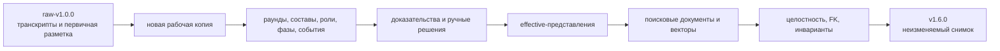

## Манифест выпуска

[`database-manifest.json`](database-manifest.json) — маленький проверяемый
паспорт большого release-файла. Он хранится в Git, поэтому позволяет понять,
какой asset должен быть скачан, не загружая БД заранее.

Манифест ветки `master` описывает только обогащённый `v1.6.0`. Сырой снимок
публикуется отдельным tag `raw-v1.0.0`; его SHA-256 совпадает с
`source_sha256` обогащённого манифеста.

| Поле | Смысл |
| --- | --- |
| `format` | версия формата самого манифеста; сейчас `1` |
| `kind` | вид набора данных; `audited-enriched` — обогащённый аудированный снимок |
| `release` | GitHub tag, которому соответствует asset; `v1.6.0` |
| `asset_name` | имя файла в Release; `app.db` |
| `data_version` | внутренняя версия из `archive_data_versions` |
| `sha256` | ожидаемый хэш готового файла |
| `size_bytes` | ожидаемый размер готового файла |
| `source_sha256` | хэш необогащённого источника, из которого собран release |
| `verification.sqlite_integrity_check` | сохранённый результат проверки SQLite |
| `verification.foreign_key_errors` | число FK-ошибок готового release, должно быть `0` |
| `verification.videos`, `rounds`, `utterances` | контрольные количества основных сущностей |
| `verification.semantic_documents`, `embedding_vectors` | контроль равенства поисковых документов и векторов |
| `published_at` | дата публикации манифеста |

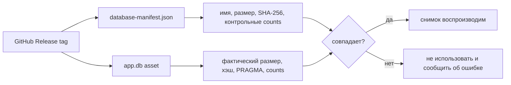

## Что входит и не входит в `app.db`

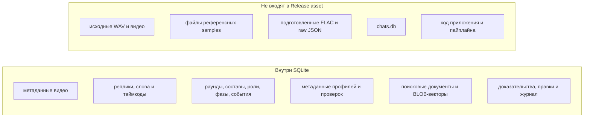

Поля `source_path`, `prepared_path`, `stored_path` и `raw_transcript_path` —
provenance-ссылки на среду сборки. Они не означают, что соответствующий файл
вложен в SQLite или доступен на другой машине. Текст транскрипта, строки
реплик и эмбеддинги находятся внутри БД; воспроизведение исходного аудио
требует отдельного медиаархива.

## Главные правила данных

- Архивный снимок не редактируется на месте. Правки материализуются только в новую копию.
- `NULL` означает «не установлено» или «не применимо», а не отрицание факта.
- `confidence` не заменяет источник и ручное решение.
- Роли в домене: только Мирный, Мафия, Дон мафии и Шериф.
- Состав и роли конкретной игры берутся из участников раунда, а не из одной отдельной реплики.
- Маска Анона/Антона разрешается для конкретного эпизода; глобально приписывать её одному профилю нельзя.
- `vote_out` — дневное выбытие, `night_kill` — ночное устранение, `last_words` — фаза речи после выбытия.
- Для чтения исправленных имён и связей предпочтительны представления `effective_*`.

## Проверка скачанного снимка

```bash
python3 - <<'PY'
import hashlib
import json
import sqlite3
from pathlib import Path

manifest = json.loads(Path('database-manifest.json').read_text())
path = Path('app.db')

digest = hashlib.sha256()
with path.open('rb') as source:
    for chunk in iter(lambda: source.read(8 * 1024 * 1024), b''):
        digest.update(chunk)

assert path.stat().st_size == manifest['size_bytes'], 'не совпал размер'
assert digest.hexdigest() == manifest['sha256'], 'не совпал SHA-256'

db = sqlite3.connect('file:app.db?mode=ro', uri=True)
assert db.execute('PRAGMA integrity_check').fetchone()[0] == 'ok'
assert db.execute('PRAGMA foreign_key_check').fetchall() == []

data_version, materialized = db.execute(
    'SELECT data_version, materialized_approved '
    'FROM archive_data_versions ORDER BY id DESC LIMIT 1'
).fetchone()
assert data_version == manifest['data_version']
assert materialized == 1

checks = {
    'videos': 'videos',
    'rounds': 'mafia_rounds',
    'utterances': 'utterances',
    'semantic_documents': 'semantic_documents',
    'embedding_vectors': 'embedding_vectors',
}
for manifest_key, table in checks.items():
    actual = db.execute(f'SELECT COUNT(*) FROM {table}').fetchone()[0]
    assert actual == manifest['verification'][manifest_key], (manifest_key, actual)

print('OK: размер, SHA-256, версия, целостность, FK и контрольные количества')
PY
```

Ожидается `integrity_check=ok`, пустой результат `foreign_key_check`, совпадающий SHA-256 и `materialized_approved=1` у готового аудированного выпуска.

## Как помочь с проверкой данных

Да, вопросы по БД и помощь с ручным просмотром приветствуются. Особенно ценны
наблюдения человека, который уже смотрит конкретный выпуск: повторно искать тот
же момент не придётся. Но опубликованный `app.db` не редактируется напрямую —
это лишило бы правку происхождения и могло бы создать дубликат.

Важно различать два уровня проверки:

- `confirmed` — строка или правка подтверждена вручную;
- `auto_verified` — кандидат прошёл автоматические проверки, но его всё ещё
  полезно перепроверить человеком;
- `needs_review` — есть основания, но факт нельзя считать твёрдым;
- `unknown` — данных недостаточно.

Название релиза «full manual audit» означает, что весь снимок прошёл
многоуровневый аудит и критические противоречия разбирались вручную. Оно **не
означает**, что каждая из 1 074 строк `mafia_events` была отдельно прослушана
человеком. Поэтому дополнительная проверка не только допустима, но и полезна.

Минимальный пакет наблюдения:

```text
Видео: точное название или YouTube ID
Раунд: номер, если известен
Таймкод: начало–конец
Наблюдение: например, «во втором голосовании выгнали Грока»
Основание: короткая цитата ведущего или ID реплики
```

Для пропущенного события желательно дополнительно указать:

```text
Тип события: vote_out / night_kill / sheriff_check / другой
Кто действовал: если это доказано и применимо
Кого затронуло: имя выбывшего или проверенного участника
Фаза: день/голосование/ночь и её номер, если понятно
Почему это отдельное событие: чем оно отличается от уже существующей строки
```

Наблюдение связывается с `audit_evidence`, затем оформляется как:

- `audit_corrections` — изменить поле существующей строки;
- `audit_event_inserts` — добавить отсутствующее событие;
- `audit_event_deletions` — убрать ошибку или дубль;
- `audit_phase_inserts` / `audit_phase_deletions` — исправить структуру фаз.

После ревью только одобренные изменения материализуются в **новую копию** БД.
Затем пересобираются поисковые документы и эмбеддинги, выполняются проверки
целостности, и публикуется новый release. Исходный release остаётся
воспроизводимым.

Передать наблюдение можно через
[новый GitHub Issue](https://github.com/Codekeeper45/ruda-data/issues/new),
вставив заполненный шаблон из этого раздела. Репозиторий публичный, Issues
включены. Если вы проверяете много соседних событий одного видео, удобнее один
Issue с таблицей таймкодов, чем отдельный Issue на каждую строку.

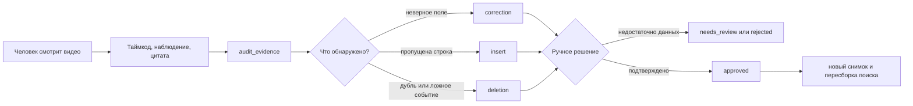

## Все диаграммы данных

Эти диаграммы объясняют не код приложения, а устройство release-снимка данных:
от исходного видео до таблиц, RAG и аудиторского решения.

## Карта доменов

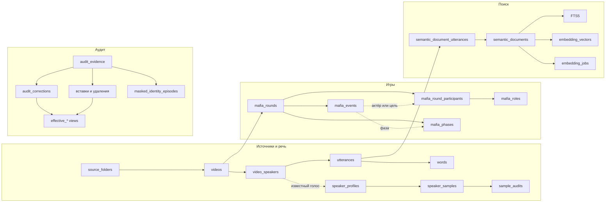

## Игровая ER-диаграмма

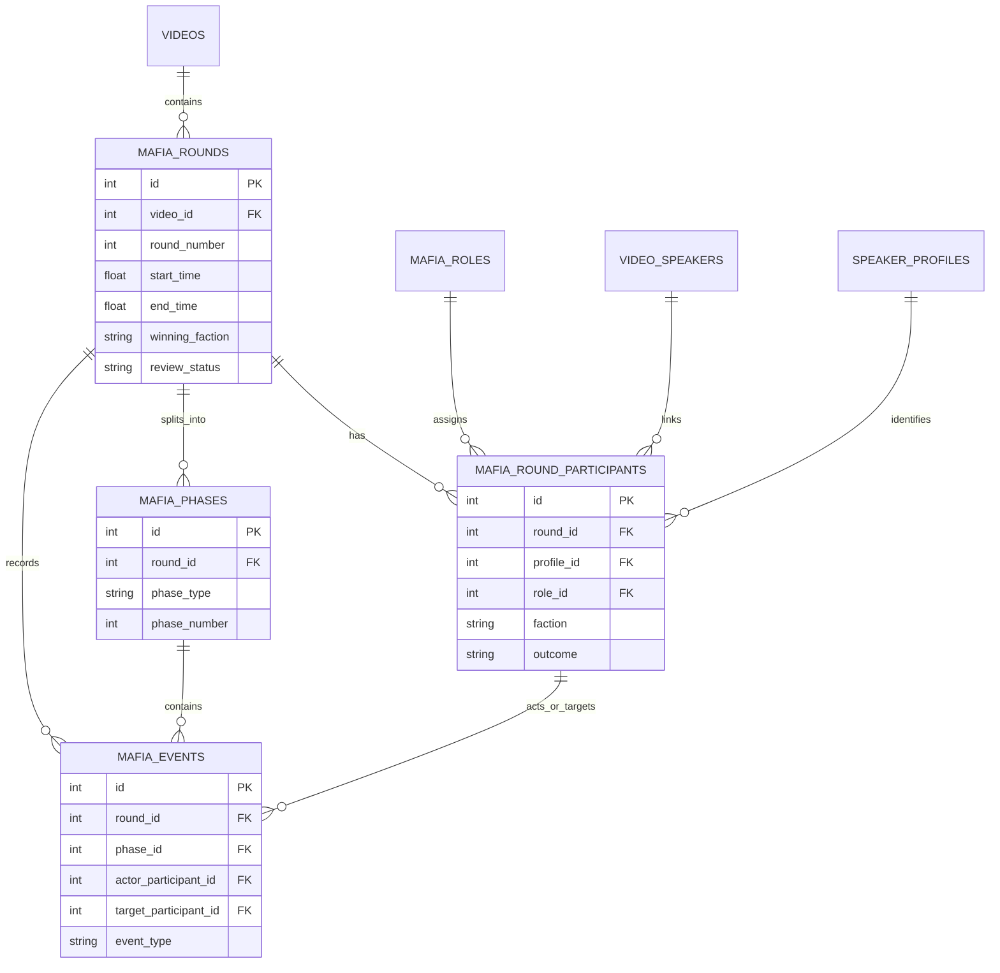

## Таймлайн раунда

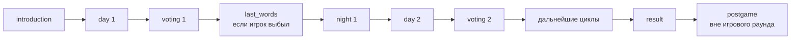

`vote_out` означает дневное выбытие по итогам голосования, `night_kill` —
ночное устранение. Фаза `last_words` объясняет, почему речь после выбытия не
является вторым событием устранения.

## Как устроены `mafia_phases` и `mafia_events`

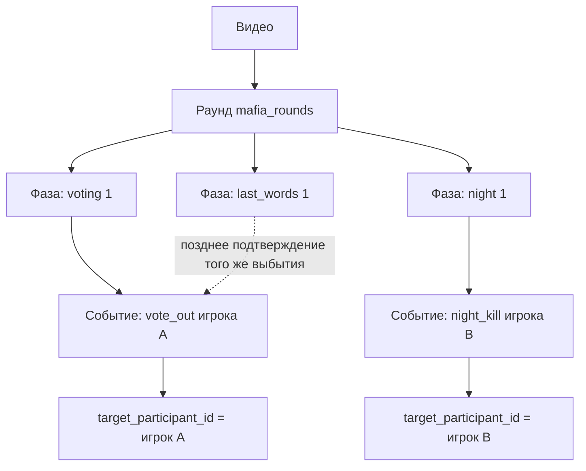

Фаза — это **протяжённый интервал**, например весь первый день. Событие — это
**один дискретный факт** внутри раунда. Одна фаза может содержать несколько
событий, а у раунда может быть несколько событий одного типа. `round_id` у
события обязателен; `phase_id` может быть `NULL`, если точную фазу доказать не
удалось.

Время события — момент, в котором факт происходит или надёжно подтверждается.
Поэтому `vote_out` нередко связан не с узкой фазой `voting`, а с `day`,
`last_words` или `result`, где ведущий назвал выбывшего. Это не превращает
событие в другой тип. Однако явная связь с `night` при дневном выбытии требует
внимания ревьюера: это может быть позднее подтверждение, неточная граница фазы
или ошибка разметки.

## Как определяется `event_type`

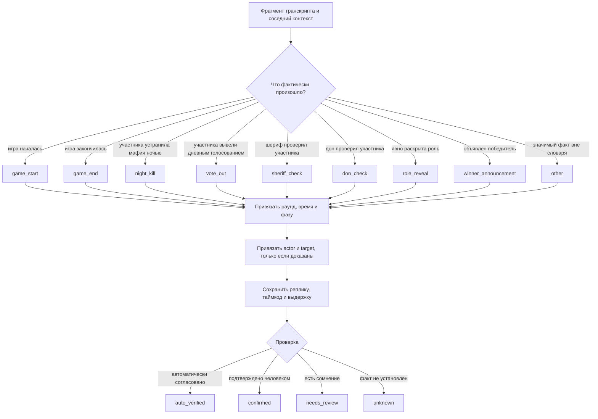

Тип выбирается по смыслу **самого действия**, а не просто по слову в тексте и
не только по названию фазы. Фраза «его убили» без контекста не гарантирует
`night_kill`: проверяются последовательность фаз, состав живых игроков,
последние слова, объявление ведущего и соседние реплики. Аналогично упоминание
слова «голосование» не создаёт `vote_out`, пока не доказано, кто действительно
выбыл.

### Как строка события появилась в текущей БД

1. Пайплайн `20260730-v1` делил транскрипт видео на контекстные фрагменты и
   извлекал кандидаты раундов, участников, фаз и событий. В разных видео
   финальным извлекателем были Ling 3.0 Flash, Nemotron 3 Super или GPT-5.6
   Luna; цепочка попыток хранится в `enrichment_runs.model`, а модель,
   сформировавшая результат, — в `video_enrichments.extractor_model`.
2. Кандидат нормализовался в ограниченный словарь `event_type`; произвольное
   название модели не становится новым типом события.
3. Событие связывалось с `round_id`, временными границами, доступной фазой и
   участниками. Недоказанные `actor`/`target` оставлялись `NULL`.
4. Происхождение поля сохранялось в `enrichment_evidence`: в v1.6.0 это
   `transcript` или `frame`, с репликой/таймкодом и выдержкой.
5. Автоматические инварианты проверяли границы, допустимые роли, ссылки и
   согласованность результата. Успешный кандидат получал `auto_verified`, а
   сомнительный — `needs_review` или `unknown`.
6. Ручной аудит не переписывал исходник: исправления, вставки и удаления
   фиксировались отдельными таблицами с evidence, затем материализовались в
   новую release-копию. Поэтому история решения сохраняется.

## Проверка полноты `vote_out`

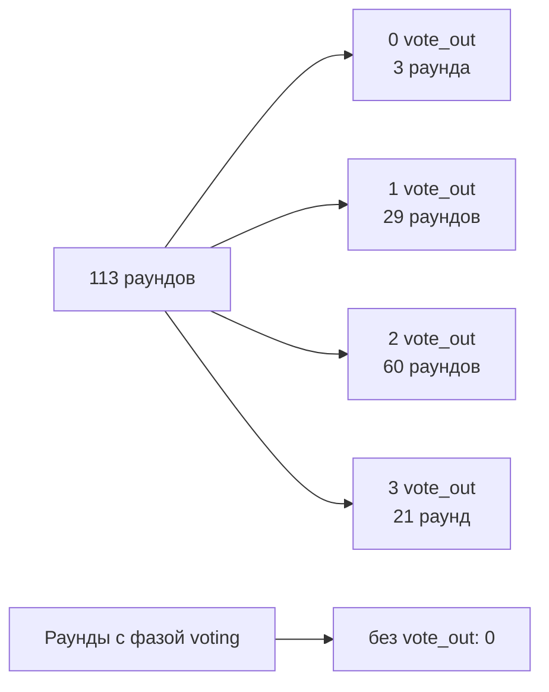

В снимке v1.6.0 находится **212** строк `vote_out` в **110** раундах;
максимум — три в одном раунде. Ограничения «одно событие на игру» нет.
Если видео содержит две подтверждённые дневные казни, а в его раунде записана
одна строка, это кандидат на `audit_event_inserts`, а не ожидаемое поведение.
При этом число фаз `voting` не обязано равняться числу `vote_out`: один длинный
интервал может охватывать голосование и объявление результата, а подтверждение
выбытия иногда находится в `last_words` или следующем фрагменте.

## Диаграмма семантического поиска

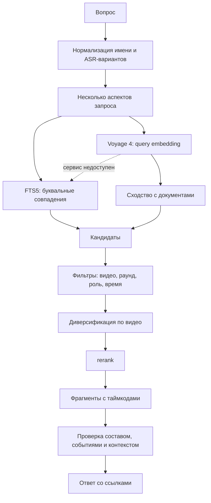

## Аудит и выпуск

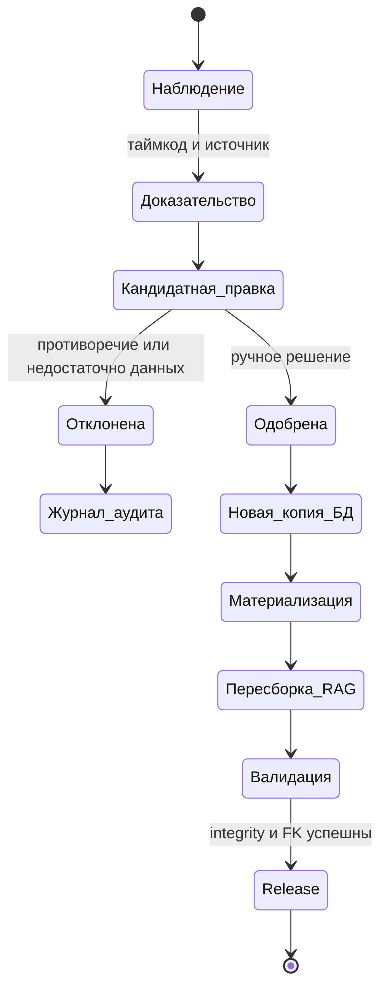

## Исторические маски и голоса

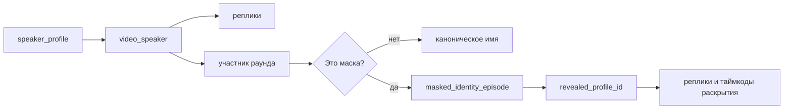

Маска не переписывает профиль глобально. Одно и то же отображаемое имя может
иметь разные раскрытия в разных видео, поэтому исторические эпизоды хранятся
отдельно.

## Полная схема: каждая таблица и поле

Документ описывает рабочую release-схему. Типы SQLite: `INTEGER` — числа и ID,
`REAL` — секунды/дробные оценки, `TEXT` — строки, `JSON` — сериализованные
структуры, `BLOB` — бинарный вектор, `BOOLEAN` — 0/1. Все времена видео —
секунды от его начала. `NULL` означает «не установлено/не применимо», а не
«факт опровергнут».

> Для отдельной версии визуальной карты откройте [диаграммы](docs/diagrams.md). Служебные FTS5
> таблицы с суффиксами `_data`, `_idx`, `_docsize`, `_config` намеренно не
> описываются: их создаёт и обслуживает SQLite, вручную их не редактируют.
> Табличный справочник с типом и смыслом каждого поля находится в
> [docs/database-schema.md](docs/database-schema.md); ниже остаётся полный
> компактный перечень, чтобы README был самодостаточным.

## Значения, общие для многих таблиц

| Поле | Допустимые/наблюдаемые значения |
| --- | --- |
| `review_status` | `confirmed`, `auto_verified`, `needs_review`, `unknown`. Первые два пригодны для подтверждённых ответов при отсутствии конфликта; последние два — нет. |
| `status` аудиторской правки | `candidate`, `approved`, `rejected`. |
| `status` технического задания | Обычно `completed` или `failed`. |
| `faction` | `civilians`, `mafia`, `unknown`. |
| `outcome` | `won`, `lost`, `unknown`. |
| `winning_faction` | `civilians`, `mafia`, `unknown`. |
| `confidence`, `role_confidence` | Оценка 0–1; не заменяет доказательство. |
| `created_at`, `updated_at`, `completed_at` | Время создания, изменения, завершения; `NULL`, если действие не наступило. |

### Наблюдаемые перечисления в v1.6.0

Это фактические значения текущего снимка и их количество, а не разрешение
добавлять новые значения без миграции.

| Поле | Значения `значение: строк` |
| --- | --- |
| `videos.status` | `completed: 127` |
| `videos.language` / `videos.model` | `ru` — 127 / `enhanced` — 127 |
| `transcription_jobs.kind` | `video` — 133, `enrollment` — 46 |
| `transcription_jobs.status` | `completed: 175`, `failed: 4` |
| `speaker_samples.status` | `pending_review: 115`, `completed: 46` |
| `sample_audits.quality_status` | `good: 149`, `warning: 12` |
| `sample_audits.manual_status` | `approved: 161` |
| `profile_reviews.manual_status` | `approved: 23` |
| `video_enrichments.content_type` | `mixed: 67`, `mafia_only: 44`, `talk_only: 16` |
| `video_enrichments.review_status` | `auto_verified: 124`, `confirmed: 2`, `needs_review: 1` |
| `mafia_rounds.winning_faction` | `mafia: 59`, `civilians: 52`, `unknown: 2` |
| `mafia_rounds.review_status` | `auto_verified: 81`, `confirmed: 31`, `unknown: 1` |
| `mafia_round_participants.faction` | `civilians: 484`, `mafia: 223`, `unknown: 194` |
| `mafia_round_participants.outcome` | `lost: 366`, `won: 334`, `unknown: 201` |
| `mafia_round_participants.review_status` | `auto_verified: 481`, `confirmed: 340`, `needs_review: 55`, `unknown: 25` |
| `mafia_phases.phase_type` | `day: 354`, `night: 264`, `last_words: 174`, `voting: 155`, `introduction: 110`, `result: 108`, `intermission: 43`, `postgame: 1` |
| `mafia_phases.review_status` | `auto_verified: 1139`, `needs_review: 51`, `confirmed: 16`, `unknown: 3` |
| `mafia_events.event_type` | `night_kill: 252`, `vote_out: 212`, `role_reveal: 210`, `game_start: 112`, `winner_announcement: 108`, `sheriff_check: 87`, `game_end: 53`, `other: 23`, `don_check: 17` |
| `mafia_events.review_status` | `auto_verified: 947`, `needs_review: 104`, `unknown: 15`, `confirmed: 8` |
| `semantic_documents.document_type` | `timeline_chunk: 9316`, `video_summary: 127`, `round_summary: 113` |
| `embedding_vectors.model` / `dtype` | `voyageai/voyage-4` — 9556 / `float32` — 9556 |
| `masked_identity_episodes.review_status` | `confirmed: 23` |
| `character_aliases.alias_type` | `canonical` — 23, `asr_error` — 1 |
| `audit_event_timing_classifications.classification` | `postgame_evidence` — 30, `pregame_evidence` — 1 |
| `audit_corrections.status` | `approved: 557`, `rejected: 6` |
| `audit_corrections.value_type` | `text: 379`, `real: 77`, `integer: 72`, `null: 35` |
| `audit_rebuild_queue.status` | `completed: 138` |

## Источники, речь и профили

### `source_folders`

Каталоги исходников: `id` (PK), `path`, `recursive`, `auto_scan`, `enabled`,
`last_scanned_at`, `last_error`, `created_at`. `recursive`, `auto_scan`,
`enabled` — boolean; путь и ошибка служебные, не пользовательские факты.

### `videos`

Одна строка на медиафайл: `id` (PK), `source_folder_id` (FK), `title`,
`original_filename`, `source_path`, `source_signature`, `source_size_bytes`,
`source_modified_ns`, `duration_seconds`, `prepared_path`,
`prepared_size_bytes`, `status`, `language`, `model`, `remote_job_id`,
`raw_transcript_path`, `transcript_text`, `error_message`, `created_at`,
`started_at`, `completed_at`.

В выпуске `status=completed`, `language=ru`, `model=enhanced`. `source_*` и
`prepared_*` — происхождение файла; `transcript_text` — сырой полный текст,
а точные границы берутся из `utterances`/`words`.

### `transcription_jobs`

Журнал внешней обработки: `id` (PK), `kind`, `status`, `video_id` (FK),
`sample_id` (FK), `remote_job_id`, `config_json`, `prepared_path`,
`attempt_count`, `next_attempt_at`, `error_message`, `created_at`, `updated_at`,
`submitted_at`, `completed_at`.

`kind=video` — транскрибация видео; `kind=enrollment` — регистрация образца.

### `speaker_profiles`

Канонический голосовой профиль: `id` (PK), `name`, `api_label`, `notes`,
`active`, `created_at`, `updated_at`. `active=1` включает профиль в
сопоставление; это не утверждение о присутствии в конкретном видео.

### `speaker_samples`

Референс-файлы профиля: `id` (PK), `profile_id` (FK), `original_filename`,
`stored_path`, `duration_seconds`, `size_bytes`, `sha256`,
`speaker_identifier`, `enrollment_model`, `enrollment_language`, `status`,
`error_message`, `created_at`, `completed_at`.

`status` обычно `completed` или `pending_review`; `sha256` защищает от
дубликата; `speaker_identifier` возвращает внешний сервис.

### `sample_audits` и `profile_reviews`

`sample_audits`: `id` (PK), `sample_id` (FK), `source_path`, `pcm_sha256`,
`sample_rate`, `channels`, `bit_depth`, `codec`, `rms_dbfs`, `peak_dbfs`,
`silence_ratio`, `clipping_ratio`, `within_profile_similarity`,
`closest_other_profile`, `closest_other_similarity`, `quality_status`,
`quality_issues`, `manual_status`, `manual_notes`, `selected_for_enrollment`,
`reviewed_at`, `audited_at`.

`quality_status` в выпуске `good` или `warning`; `quality_issues` — JSON;
`selected_for_enrollment=1` означает включение образца в профиль.

`profile_reviews`: `id` (PK), `profile_id` (FK), `manual_status`, `notes`,
`reviewed_at`, `updated_at`. В текущем выпуске все 23 профиля `approved`.

### `video_speakers`, `utterances`, `words`

`video_speakers`: `id` (PK), `video_id` (FK), `label`, `display_name`,
`profile_id` (FK), `is_known`, `total_speech_seconds`, `utterance_count`.
`label` — локальная метка диаризации; один label в разных видео не является
глобальным персонажем.

`utterances`: `id` (PK), `video_id` (FK), `speaker_id` (FK), `sequence`,
`start_time`, `end_time`, `text`, `average_confidence`, `word_count`. Это
основная реплика с таймкодом; `text` может содержать ASR-ошибку.

`words`: `id` (PK), `video_id` (FK), `utterance_id` (FK), `speaker_id` (FK),
`sequence`, `token_type`, `content`, `start_time`, `end_time`, `confidence`,
`language`, `attaches_to`, `is_eos`, `raw_json`. `token_type=word` или
`punctuation`; у пунктуации `attaches_to=previous`.

## Игровая модель

### `video_enrichments` и `enrichment_runs`

`video_enrichments`: `video_id` (PK/FK), `content_type`, `has_mafia`,
`confidence`, `status`, `review_status`, `extractor_model`,
`extractor_version`, `source_hash`, `error_message`, `raw_result`,
`created_at`, `updated_at`, `completed_at`.

`content_type`: `talk_only`, `mafia_only`, `mixed`. `raw_result` — технический
JSON извлекателя, не источник финального пользовательского факта.

`enrichment_runs`: `id` (PK), `video_id` (FK), `stage`, `status`, `model`,
`pipeline_version`, `input_hash`, `attempt_count`, `prompt_tokens`,
`completion_tokens`, `estimated_cost_usd`, `raw_output_path`, `error_message`,
`created_at`, `started_at`, `completed_at`. В текущем выпуске `stage=extract`.

### `enrichment_evidence`

Связывает извлечённое поле с происхождением: `id` (PK), `entity_type`,
`entity_id`, `field_name`, `utterance_id` (FK), `start_time`, `end_time`,
`source_type`, `source_ref`, `excerpt`, `confidence`, `created_at`.

### `mafia_roles`

Справочник ролей: `id` (PK), `code`, `name`, `faction`, `aliases`,
`description`, `created_at`.

Допустимые `code`: `civilian`, `mafia`, `don`, `sheriff`. Других игровых ролей
в домене нет. `faction=civilians` у Мирного/Шерифа, `faction=mafia` у
Мафии/Дона.

### `mafia_rounds`

Партия в рамках видео: `id` (PK), `video_id` (FK), `round_number`,
`start_time`, `end_time`, `start_utterance_id` (FK), `end_utterance_id` (FK),
`is_partial`, `winning_faction`, `winner_summary`, `confidence`,
`review_status`, `extractor_version`, `created_at`, `updated_at`.

`is_partial=1` означает обрезанную/неполную игру. `winning_faction=unknown`
не должен превращаться в победу какой-либо стороны.

### `mafia_round_participants`

Состав конкретного раунда: `id` (PK), `round_id` (FK), `profile_id` (FK),
`video_speaker_id` (FK), `display_name`, `role_id` (FK), `faction`, `outcome`,
`confidence`, `role_confidence`, `review_status`, `notes`, `created_at`,
`updated_at`.

Это главный источник для вопроса «кто был мафией в игре». `role_id=NULL` не
запрещает известную фракцию: Мафия может быть установлена, а Дон/обычная Мафия
— нет.

### `mafia_phases`

Непрерывные части раунда: `id` (PK), `round_id` (FK), `phase_type`,
`phase_number`, `start_time`, `end_time`, `is_partial`, `confidence`,
`review_status`, `created_at`.

`phase_type`: `introduction`, `day`, `voting`, `night`, `last_words`,
`result`, `intermission`, `postgame`. `phase_number` нумерует дни/ночи и может
быть `NULL` для вступления или результата.

### `mafia_events`

Дискретные действия: `id` (PK), `round_id` (FK), `phase_id` (FK),
`event_type`, `actor_participant_id` (FK), `target_participant_id` (FK),
`start_time`, `end_time`, `summary`, `confidence`, `review_status`,
`created_at`.

`event_type`: `game_start`, `game_end`, `night_kill`, `vote_out`,
`sheriff_check`, `don_check`, `role_reveal`, `winner_announcement`, `other`.
`actor_participant_id` и `target_participant_id` могут быть `NULL`, если
участник не доказан. В одном раунде допускается несколько `vote_out`.

#### Смысл каждого `event_type`

| Тип | Когда создаётся | `actor_participant_id` | `target_participant_id` |
| --- | --- | --- | --- |
| `game_start` | доказано начало партии | обычно `NULL` | обычно `NULL` |
| `game_end` | доказано окончание партии | обычно `NULL` | обычно `NULL` |
| `night_kill` | участник устранён мафией в ночной ход | часто `NULL`, потому что действует команда | выбывший участник, если установлен |
| `vote_out` | участник выбыл по итогам дневного голосования | обычно `NULL`, потому что решение коллективное | выбывший участник, если установлен |
| `sheriff_check` | шериф выполнил ночную проверку | шериф, если личность доказана | проверенный участник |
| `don_check` | дон выполнил ночную проверку | дон, если личность доказана | проверенный участник |
| `role_reveal` | роль участника явно раскрыта или достоверно объявлена | говорящий/раскрывающий, если это важно и доказано | участник, чья роль раскрыта |
| `winner_announcement` | ведущий или финальный контекст объявил победившую сторону | обычно `NULL` | обычно `NULL` |
| `other` | важное игровое действие не помещается в словарь выше | по ситуации | по ситуации |

`actor_participant_id=NULL` не означает «никто не действовал».
Для коллективного голосования или ночного решения мафии исполнитель может не
иметь единственного корректного участника. `target_participant_id=NULL` значит
«цель не установлена надёжно», а не «цели не было».

#### Ответы на частые вопросы про события

**`event_type` — это событие, произошедшее в определённой фазе определённой
игры?** Да, но с уточнением: событие всегда принадлежит одному раунду через
`round_id`; связь с фазой через `phase_id` необязательна. Тип описывает, **что
произошло**, а фаза — **в каком временном участке это произошло или было
подтверждено**.

**Одна строка `mafia_events` — это вся фаза?** Нет. Фаза длится минуты и
хранится в `mafia_phases`; строка события — один факт с собственным коротким
таймкодом. В одной фазе могут находиться несколько событий.

**Может ли в одном раунде быть несколько `vote_out`?** Да. В текущем снимке
есть раунды с двумя и тремя `vote_out`. Уникального ограничения по паре
`(round_id, event_type)` нет.

**Если в конкретном раунде записан только один `vote_out`, это баг?** Не
обязательно: игра могла закончиться после одного дневного выбытия. Но если
видео явно показывает вторую дневную казнь, которой нет в таблице, это пробел
обогащения и кандидат на аудиторскую вставку.

**Все ли события просмотрены человеком?** Нет. Статус строки отвечает на этот
вопрос точнее общего названия релиза: в v1.6.0 у событий 8 `confirmed`,
947 `auto_verified`, 104 `needs_review` и 15 `unknown`. Для статистики обычно
используются `confirmed` и `auto_verified`, но ручное подтверждение особенно
полезно для `needs_review` и для заметных пропусков.

#### Запрос: показать все события раунда

```sql
SELECT
  e.id,
  e.event_type,
  e.start_time,
  e.end_time,
  p.phase_type,
  p.phase_number,
  target.character_name AS target_name,
  e.review_status,
  e.summary
FROM mafia_events AS e
JOIN mafia_rounds AS r ON r.id = e.round_id
LEFT JOIN mafia_phases AS p ON p.id = e.phase_id
LEFT JOIN effective_mafia_round_participants AS target
  ON target.id = e.target_participant_id
WHERE e.round_id = :round_id
ORDER BY e.start_time, e.id;
```

#### Запрос: посчитать `vote_out` в каждом раунде

```sql
SELECT
  r.id AS round_id,
  v.title,
  r.round_number,
  COUNT(e.id) AS vote_out_count
FROM mafia_rounds AS r
JOIN videos AS v ON v.id = r.video_id
LEFT JOIN mafia_events AS e
  ON e.round_id = r.id
 AND e.event_type = 'vote_out'
GROUP BY r.id, v.title, r.round_number
ORDER BY v.id, r.round_number;
```

Этот запрос диагностический: малое число само по себе не доказывает ошибку.
Окончательное решение принимается после просмотра таймлайна, последних слов и
объявлений ведущего.

## Семантический поиск: таблицы

### `semantic_documents` и FTS5

`semantic_documents`: `id` (PK), `document_type`, `video_id` (FK),
`round_id` (FK), `start_time`, `end_time`, `text`, `token_count`,
`content_hash`, `pipeline_version`, `created_at`, `updated_at`.

`document_type`: `timeline_chunk`, `round_summary`, `video_summary`.
`semantic_documents_fts` — виртуальная FTS5-таблица с полем `text`;
используется для буквального поиска.

`semantic_document_utterances`: `document_id` (PK/FK), `utterance_id`
(PK/FK), `sequence`. Это составная связь документа с исходными репликами.

### `embedding_vectors` и `embedding_jobs`

`embedding_vectors`: `id` (PK), `document_id` (FK), `model`, `dimensions`,
`dtype`, `vector`, `content_hash`, `created_at`. В текущем выпуске модель
`voyageai/voyage-4`; `vector` — BLOB, его не редактируют вручную.

`embedding_jobs`: `id` (PK), `document_id` (FK), `model`, `dimensions`,
`input_hash`, `status`, `attempt_count`, `error_message`, `created_at`,
`updated_at`, `completed_at`. Это очередь/история пересчёта векторов.

## Канонические имена, маски и effective views

`canonical_characters`: `id` (PK), `profile_id` (FK), `canonical_name`,
`english_name`, `status`, `source_ref`, `created_at`, `updated_at`.
`status=active` у актуальных 23 персонажей.

`character_aliases`: `id` (PK), `canonical_character_id` (FK), `alias`,
`alias_key`, `alias_type`, `review_status`, `confidence`, `rationale`,
`valid_from_video_id` (FK), `valid_to_video_id` (FK), `created_at`,
`updated_at`. `alias_type=canonical` или `asr_error`.

`character_alias_evidence`: `alias_id` (PK/FK), `evidence_id` (PK/FK).

`masked_identity_episodes`: `id` (PK), `video_id` (FK), `round_id` (FK),
`participant_id` (FK), `mask_name`, `start_time`, `end_time`,
`revealed_profile_id` (FK), `revealed_name`, `confidence`, `review_status`,
`evidence_summary`, `notes`, `created_at`, `updated_at`.

`masked_identity_episode_evidence`: `episode_id` (PK/FK), `evidence_id`
(PK/FK). Маску нельзя глобально заменить одним профилем: раскрытие относится
к эпизоду видео/раунда.

`effective_video_speakers` содержит исходные поля `video_speakers` плюс
`effective_profile_id`, `effective_display_name`, `applied_correction_id`.

`effective_utterances` содержит поля `utterances` плюс `effective_speaker_id`,
`effective_start_time`, `effective_end_time`, `effective_text`,
`effective_profile_id`, `effective_display_name`, `applied_correction_id`.

`effective_mafia_round_participants` содержит поля участников плюс
`effective_profile_id`, `effective_display_name`, `character_name`,
`effective_faction`, `effective_role_id`, `role_code`, `role_name`,
`applied_correction_id`. В runtime нужно предпочитать эти представления
сырым таблицам.

## Аудиторский контур

`audit_evidence`: `id` (PK), `source_type`, `source_ref`, `video_id` (FK),
`utterance_id` (FK), `start_time`, `end_time`, `excerpt`, `sha256`,
`created_at`.

`audit_corrections`: `id` (PK), `entity_type`, `entity_id`, `field_name`,
`old_value`, `proposed_value`, `value_type`, `status`, `confidence`,
`evidence_required`, `rationale`, `reviewer`, `reviewed_at`, `created_at`,
`updated_at`. В выпуске `entity_type`: `mafia_round_participant`,
`mafia_phase`, `mafia_event`, `mafia_round`, `video_speaker`,
`video_enrichment`; `value_type`: `text`, `integer`, `real`, `null`.

`audit_correction_evidence`: `correction_id` (PK/FK), `evidence_id` (PK/FK).

`audit_phase_inserts`: `id` (PK), `round_id` (FK), `phase_type`,
`phase_number`, `start_time`, `end_time`, `is_partial`, `confidence`,
`review_status`, `status`, `rationale`, `materialized_phase_id`, `created_at`,
`updated_at`; `audit_phase_insert_evidence`: `phase_insert_id` (PK/FK),
`evidence_id` (PK/FK).

`audit_participant_inserts`: `id` (PK), `participant_id`, `round_id` (FK),
`profile_id` (FK), `video_speaker_id` (FK), `display_name`, `role_id` (FK),
`faction`, `outcome`, `confidence`, `role_confidence`, `review_status`,
`notes`, `status`, `rationale`, `materialized_participant_id`, `created_at`,
`updated_at`; `audit_participant_insert_evidence`: `participant_insert_id`
(PK/FK), `evidence_id` (PK/FK).

`audit_event_inserts`: `id` (PK), `event_id`, `round_id` (FK), `phase_id`
(FK), `event_type`, `actor_participant_id` (FK), `target_participant_id` (FK),
`start_time`, `end_time`, `summary`, `confidence`, `review_status`, `status`,
`rationale`, `materialized_event_id`, `created_at`, `updated_at`;
`audit_event_insert_evidence`: `event_insert_id` (PK/FK), `evidence_id`
(PK/FK).

`audit_event_deletions`: `id` (PK), `event_id` (FK), `expected_json`,
`status`, `rationale`, `created_at`, `updated_at`; связь с источниками в
`audit_event_deletion_evidence`: `event_deletion_id` (PK/FK), `evidence_id`
(PK/FK).

`audit_phase_deletions`: `id` (PK), `phase_id` (FK), `expected_json`,
`status`, `rationale`, `created_at`, `updated_at`; связь с источниками в
`audit_phase_deletion_evidence`: `phase_deletion_id` (PK/FK), `evidence_id`
(PK/FK).

`audit_event_timing_classifications`: `event_id` (PK/FK), `round_id` (FK),
`classification`, `evidence_id` (FK), `rationale`, `created_at`.

`audit_ledger`: `id` (PK), `event_type`, `entity_type`, `entity_key`,
`old_value`, `new_value`, `actor`, `reason`, `evidence_json`, `created_at`.
Это append-only история действий.

`audit_rebuild_queue`: `id` (PK), `artifact_type`, `entity_id`, `reason`,
`status`, `created_at`, `completed_at`. В выпуске `artifact_type` —
`semantic_documents`; очередь требует пересобрать производные данные.

`archive_data_versions`: `id` (PK), `schema_version`, `data_version`,
`source_sha256`, `source_size_bytes`, `source_wal_sha256`,
`source_wal_size_bytes`, `source_snapshot_sha256`,
`source_foreign_key_errors`, `source_foreign_key_errors_json`, `built_at`,
`builder_version`, `materialized_approved`. `materialized_approved=1` означает,
что одобренные правки были наложены на release-копию.

`schema_migrations`: `version` (PK), `applied_at`.
`app_settings`: `key` (PK), `value`, `encrypted`, `updated_at`.

## Ограничения, триггеры и индексы

Схема защищает не только форму строк, но и происхождение исправлений.

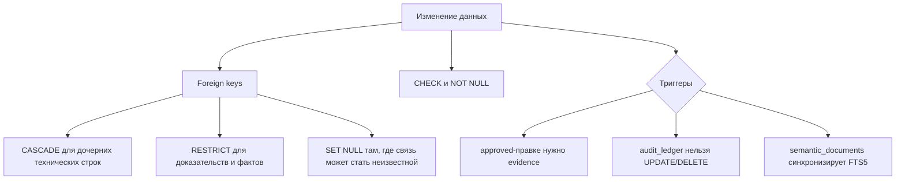

### Семь прикладных триггеров

| Триггер | Что гарантирует |
| --- | --- |
| `alias_approval_requires_evidence` | не позволяет одобрить неканонический алиас без связанного доказательства |
| `correction_approval_requires_evidence` | не позволяет одобрить требующую доказательства правку без `audit_correction_evidence` |
| `audit_ledger_no_update` | запрещает менять старую запись журнала |
| `audit_ledger_no_delete` | запрещает удалять старую запись журнала |
| `semantic_documents_ai` | добавляет новый поисковый документ в FTS5 |
| `semantic_documents_au` | обновляет FTS5 после изменения текста документа |
| `semantic_documents_ad` | удаляет документ из FTS5 вместе с исходной строкой |

### Что ускоряют индексы

Все часто используемые связи имеют индексы: `video_id`, `round_id`,
`speaker_id`, `profile_id`, `role_id`, `phase_id`, `actor_participant_id`,
`target_participant_id` и `utterance_id`. Отдельно индексируются фильтры
`event_type`, `phase_type`, `review_status`, `winning_faction`, `faction`,
`outcome`, `content_type`, статусы заданий, хэши документов и модель
эмбеддинга. Составные индексы покрывают временные выборки по видео/раунду и
поиск аудиторской правки по сущности.

Полный актуальный список можно получить из самого снимка:

```sql
SELECT type, name, tbl_name, sql
FROM sqlite_master
WHERE type IN ('index', 'trigger', 'view')
  AND name NOT LIKE 'sqlite_%'
ORDER BY type, tbl_name, name;
```

Служебные auto-index и shadow-таблицы FTS5 не являются публичным API схемы и
не должны редактироваться вручную.

## Отдельная БД чатов

В release `app.db` чатов нет: приложение хранит их в отдельной `chats.db`.
`ruda_chats`: `id` (PK), `owner`, `title`, `mode`, `created_at`, `updated_at`.
`ruda_messages`: `id` (PK), `chat_id` (FK), `role`, `content`, `sources`,
`steps`, `ts`. Это защищает архив от записи во время работы ассистента.

## Выпуск новой версии

1. Взять исходный снимок в режиме только чтения.
2. Скопировать его через согласованный SQLite snapshot/Backup API.
3. Применить только `approved` исправления к копии.
4. Пересобрать зависимые `semantic_documents` и `embedding_vectors`.
5. Проверить доменные инварианты, `integrity_check`, foreign keys и отсутствие незавершённой `audit_rebuild_queue`.
6. Записать `archive_data_versions`, SHA-256, размер и версию сборщика.
7. Опубликовать новый Release asset, не заменяя исторический файл.

Исполняемые скрипты материализации находятся в приватном репозитории владельца
и запускаются сопровождающим релиза. Публичный вклад не требует доступа к ним:
ревьюер передаёт evidence через Issue, а опубликованный результат можно
независимо проверить командами из раздела «Проверка скачанного снимка».

## История версий

Релизы `v1.0.0`–`v1.5.0` сохранены для воспроизводимости прежних ответов и аудитов. Для обычного использования берите `v1.6.0`; для исходного сравнения — `raw-v1.0.0`.

## Лицензия и права на материалы

В репозитории пока нет файла `LICENSE`. Публичная доступность GitHub и Release
asset сама по себе не выдаёт явную лицензию на перераспространение,
коммерческое использование или создание производных наборов. До появления
лицензии такие сценарии нужно согласовывать с владельцем репозитория.

База содержит производные транскрипты и метаданные публичных видео, но не
передаёт права на исходные видео, аудио или голоса. Исходные медиа регулируются
правами их владельцев и правилами платформы, на которой они опубликованы.

## Безопасность и ограничения

- Не публикуйте API-ключи, токены, локальные приватные пути или личные данные.
- В v1.6.0 поля происхождения `source_folders.path`, `videos.source_path`,
  `speaker_samples.stored_path` и `sample_audits.source_path` содержат локальные
  пути машины сборки. Они не работают на другой машине, не являются игровыми
  фактами и должны быть очищены или заменены относительными путями в следующем
  публичном выпуске.
- `app_settings` содержит зашифрованные значения для двух секретных настроек с
  `encrypted=1`. Проверка release-файла не нашла открытых строк, похожих на
  ключи OpenRouter, Google, Hugging Face или Meta. Шифротекст всё равно нельзя
  считать общим способом распространения секретов; новые ключи в БД не
  добавляются.
- ASR-текст может ошибаться и не является дословной стенограммой без проверки аудио.
- Неподтверждённые роли, победители и участники не должны превращаться в жёсткие аналитические факты.
- Векторы помогают находить кандидатов, но доказательством остаются исходные строки, таймкоды и аудиторские свидетельства.
