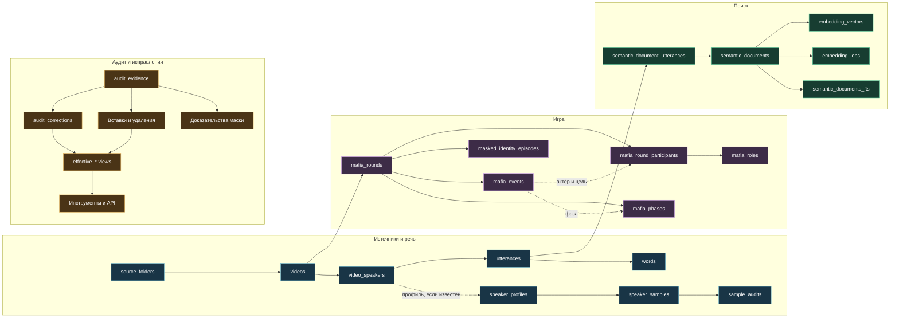
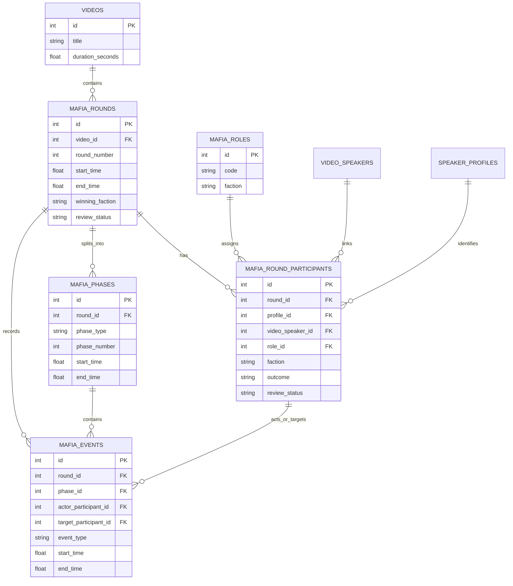
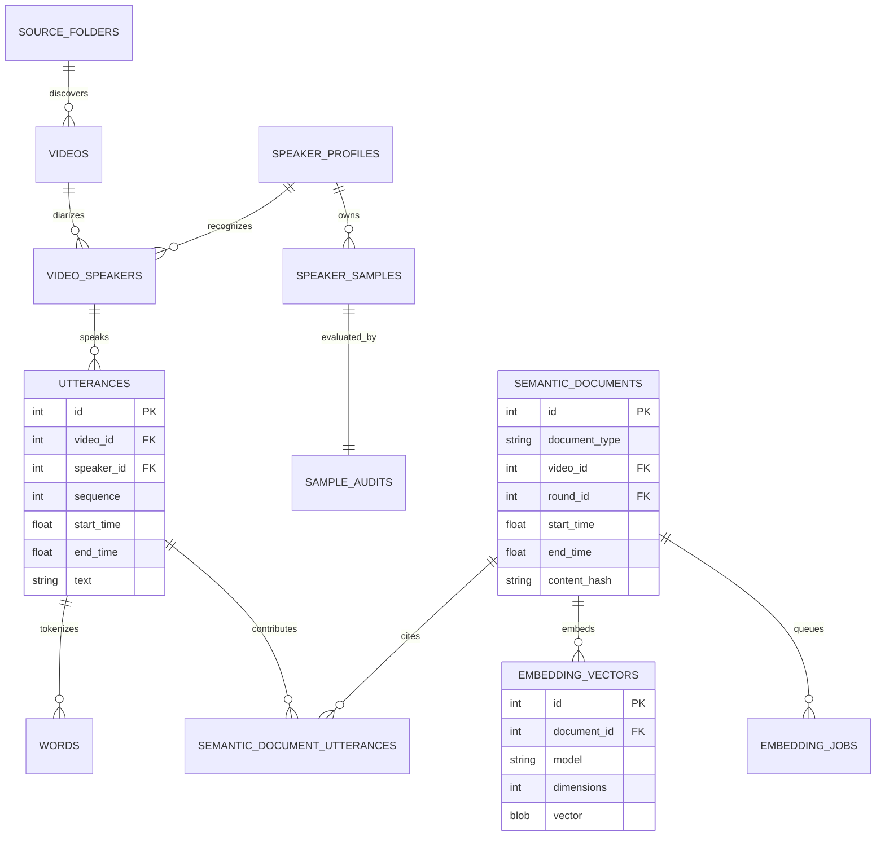
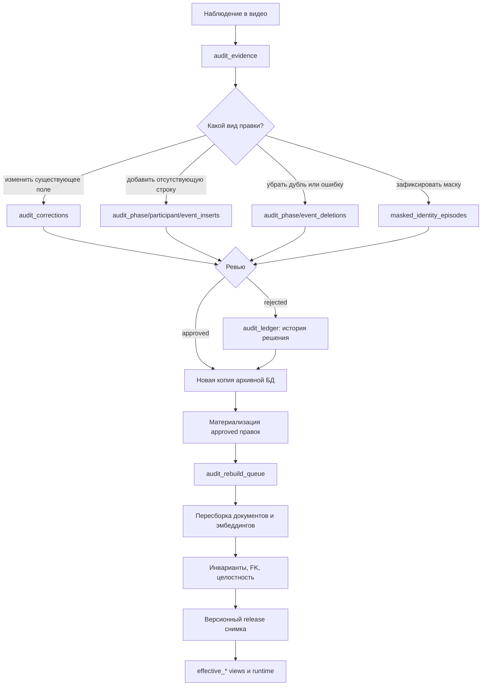
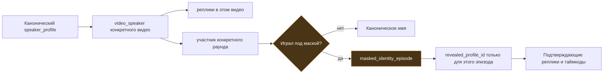
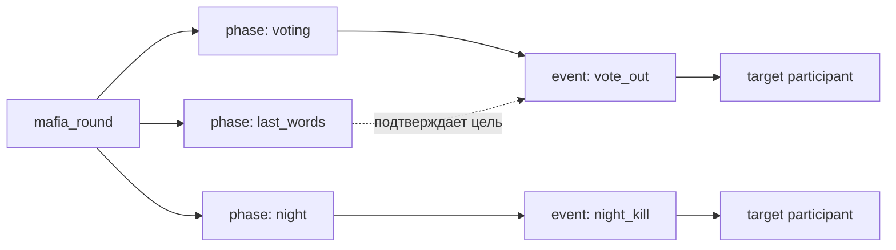

# Схема базы данных РУДА

Этот документ описывает фактическую схему архивного снимка, с которым работает
РУДА: таблицы, поля, связи, статусы и границы смысла. Он предназначен для
разработчика, ревьюера данных и автора следующего аудита.

Начать знакомство лучше с [главного README](../README.md); отдельная
[галерея диаграмм](diagrams.md) позволяет увидеть связи без чтения всех полей.

> **Важно.** SQLite слабо навязывает перечисления на уровне типов. Поэтому
> «значения» ниже — это либо доменное правило, либо значения, фактически
> встречающиеся в аудированном снимке. Не считайте отсутствие значения в
> списке разрешением придумать новое: перед расширением схемы/перечисления
> нужна миграция и тест.

## 1. Общие правила

### Типы и обозначения

| Обозначение | Смысл |
| --- | --- |
| `PK` | Первичный ключ. Уникально идентифицирует строку. |
| `FK` | Логическая или реальная ссылка на строку другой таблицы. Не все старые источники имеют полностью строгие foreign keys, поэтому выпуск дополнительно проходит `foreign_key_check`. |
| `NULL` | «Не установлено»/«не применимо». Это **не** «нет события», «нет роли» или «никого не было». |
| `INTEGER` | Целое число: идентификатор, порядковый номер, размер в байтах, Unix-время. |
| `REAL` / `FLOAT` | Число с дробной частью. Времена в архиве — секунды от начала видео. `confidence` обычно лежит в диапазоне 0–1. |
| `TEXT` | Строка UTF-8. |
| `JSON` | Текст JSON; SQLite не проверяет структуру автоматически. |
| `BLOB` | Бинарные данные, например эмбеддинг. |
| `BOOLEAN` | В SQLite хранится как 0/1. |
| `DATETIME` / `TEXT`-время | Время создания/изменения в техническом формате источника. |

### Общие статусы достоверности

Эти статусы встречаются в игровых, аудиторских и технических таблицах. Они не
взаимозаменяемы: `review_status` отвечает за доверие к факту, а `status` у
задания — за ход обработки.

| Поле/значение | Значение |
| --- | --- |
| `review_status=confirmed` | Факт явно принят в аудиторском контуре; для ручных вставок и исправлений решение опирается на сохранённое свидетельство. |
| `review_status=auto_verified` | Факт прошёл автоматические проверки пайплайна. Подходит для поиска, но может быть оспорен ручным ревью. |
| `review_status=needs_review` | Есть кандидат, но он не должен использоваться как твёрдый ответ. |
| `review_status=unknown` | Извлечение не установило факт. |
| `status=candidate` | Предложение аудита ещё не принято. |
| `status=approved` | Правка принята и может быть материализована. |
| `status=rejected` | Правка проверена и отклонена; запись остаётся для истории. |
| `status=completed` | Техническое задание успешно завершено. |
| `status=failed` | Техническое задание завершилось ошибкой. |
| `confidence` | Вероятностная оценка извлечения/сопоставления. Высокое число само по себе не заменяет источники и ревью. |

### Канонические игровые перечисления

| Понятие | Значения и смысл |
| --- | --- |
| `mafia_roles.code` | `civilian`, `mafia`, `don`, `sheriff`. Это единственные роли в домене. |
| `faction` | `civilians`, `mafia`, `unknown`. Фракция — не обязательно точная роль. |
| `outcome` | `won`, `lost`, `unknown`: личный результат участника в раунде. |
| `winning_faction` | `civilians`, `mafia`, `unknown`: победившая фракция раунда. |
| `content_type` | `talk_only`, `mafia_only`, `mixed`: разговорный стрим, только мафия или смешанное видео. |
| `phase_type` | `introduction`, `day`, `voting`, `night`, `last_words`, `result`, `intermission`, `postgame`. |
| `event_type` | `game_start`, `game_end`, `night_kill`, `vote_out`, `sheriff_check`, `don_check`, `role_reveal`, `winner_announcement`, `other`. |

`vote_out` означает подтверждённое дневное выбытие по голосованию. В одном
раунде их может быть 0, 1, 2 или больше; в текущем снимке максимум — 3.
`night_kill` — устранение ночью. Последние слова сами по себе не равны
`night_kill` и обычно принадлежат фазе `last_words`.

### Привязка справочника к снимку v1.6.0

Справочник проверен против опубликованного файла размером 550 047 744 байта с
SHA-256
`7358e0752366dbf0f27d5ea49e3ed7355dba8570c73b042a9afd4cedca37d556`.
В нём 127 видео, 31 033 реплики, 113 игровых раундов, 1 209 фаз, 1 074
события, 9 556 семантических документов и столько же эмбеддингов.
`integrity_check` успешен, актуальный `foreign_key_check` пуст.

`archive_data_versions.source_foreign_key_errors=42` хранит историю проблем
необогащённого **источника до аудита**. Это не 42 ошибки готового release.

## 2. Карта связей

### Полная карта доменов



### ER-диаграмма игровой части



### ER-диаграмма речи и смыслового поиска



### Диаграмма аудита: от наблюдения до нового снимка



### Диаграмма исторических масок и голосов



```text
source_folders ──< videos ──< video_speakers ──< utterances ──< words
                         │          │
                         │          └── speaker_profiles ──< speaker_samples ──< sample_audits
                         │
                         ├──< video_enrichments
                         ├──< enrichment_runs ──< enrichment_evidence
                         └──< mafia_rounds ──< mafia_phases
                                      ├──< mafia_events
                                      └──< mafia_round_participants >── mafia_roles

utterances ──< semantic_document_utterances >── semantic_documents ──< embedding_vectors
                                                              └──────< embedding_jobs

audit_evidence ──< evidence-link tables >── audit_corrections / inserts / deletions / masked identities
```

Пути с `effective_…` — это представления. Они накладывают одобренные
аудиторские исправления поверх исходных данных и являются предпочтительным
источником для чтения в интерфейсе и инструментах.

## 3. Архив источников и распознавание речи

### `source_folders`

Каталог, из которого был обнаружен исходный медиафайл.

В v1.6.0 абсолютные локальные пути сохранены как provenance-метаданные. Они
не переносимы и не должны использоваться как путь на машине пользователя;
следующий публичный снимок должен заменить их относительными или очищенными
значениями.

| Поле | Тип | Значения/смысл |
| --- | --- | --- |
| `id` | INTEGER PK | Идентификатор папки. |
| `path` | TEXT | Путь к папке на машине обработки. Не публикуется как пользовательский факт. |
| `recursive` | BOOLEAN | `1` — сканировать вложенные папки, `0` — только этот уровень. |
| `auto_scan` | BOOLEAN | `1` — папка участвует в автоматическом сканировании. |
| `enabled` | BOOLEAN | `1` — источник активен. |
| `last_scanned_at` | DATETIME, NULL | Время последнего сканирования. |
| `last_error` | TEXT, NULL | Последняя техническая ошибка сканирования. |
| `created_at` | DATETIME | Время регистрации источника. |

### `videos`

Одна строка на исходное видео/аудиоархив.

| Поле | Тип | Значения/смысл |
| --- | --- | --- |
| `id` | INTEGER PK | Идентификатор видео; используется в связях и API. |
| `source_folder_id` | INTEGER FK, NULL | Ссылка на `source_folders.id`. |
| `title` | TEXT | Читаемое название выпуска. |
| `original_filename` | TEXT | Имя файла до обработки. |
| `source_path` | TEXT | Локальный путь исходника; инфраструктурное поле. |
| `source_signature` | TEXT | Хэш/сигнатура для определения изменения исходника. |
| `source_size_bytes` | INTEGER | Размер исходника в байтах. |
| `source_modified_ns` | INTEGER | Время изменения исходника в наносекундах. |
| `duration_seconds` | REAL, NULL | Длина записи в секундах. |
| `prepared_path` | TEXT, NULL | Временная подготовленная копия для распознавания. |
| `prepared_size_bytes` | INTEGER, NULL | Размер подготовленной копии. |
| `status` | TEXT | Техническое состояние; в выпуске все строки `completed`. |
| `language` | TEXT | Язык распознавания; в выпуске `ru`. |
| `model` | TEXT | Режим/модель транскрипции; в выпуске `enhanced`. |
| `remote_job_id` | TEXT, NULL | ID задания внешнего сервиса. |
| `raw_transcript_path` | TEXT, NULL | Путь к исходному техническому результату распознавания. |
| `transcript_text` | TEXT, NULL | Полный сырой текст транскрипта; для точного поиска предпочтительнее `utterances`. |
| `error_message` | TEXT, NULL | Ошибка обработки, если была. |
| `created_at` | DATETIME | Регистрация видео. |
| `started_at` | DATETIME, NULL | Старт транскрибации. |
| `completed_at` | DATETIME, NULL | Завершение транскрибации. |

### `transcription_jobs`

Журнал заданий внешней транскрибации и регистрации голосовых профилей.

| Поле | Тип | Значения/смысл |
| --- | --- | --- |
| `id` | INTEGER PK | Идентификатор задания. |
| `kind` | TEXT | `video` — транскрибация видео; `enrollment` — регистрация образца голоса. |
| `status` | TEXT | Технический статус, фактически `completed` или `failed`. |
| `video_id` | INTEGER FK, NULL | Видео для задания типа `video`. |
| `sample_id` | INTEGER FK, NULL | Образец для `enrollment`. |
| `remote_job_id` | TEXT, NULL | ID у провайдера. |
| `config_json` | JSON, NULL | Параметры отправленного задания. |
| `prepared_path` | TEXT, NULL | Подготовленный медиафайл. |
| `attempt_count` | INTEGER | Количество попыток. |
| `next_attempt_at` | DATETIME, NULL | Время отложенного повтора. |
| `error_message` | TEXT, NULL | Последняя ошибка. |
| `created_at`, `updated_at` | DATETIME | Создание и последнее изменение задания. |
| `submitted_at`, `completed_at` | DATETIME, NULL | Моменты отправки и завершения. |

### `video_speakers`

Локальные диаризационные дорожки: один и тот же `label` в разных видео не
обязан быть одним и тем же персонажем.

| Поле | Тип | Значения/смысл |
| --- | --- | --- |
| `id` | INTEGER PK | Идентификатор локального спикера. |
| `video_id` | INTEGER FK | Родительское видео. |
| `label` | TEXT | Техническая метка вида `SPEAKER_00`. |
| `display_name` | TEXT | Имя, которое было присвоено на момент обработки; может быть исправлено view. |
| `profile_id` | INTEGER FK, NULL | Связь с каноническим голосовым профилем, если установлена. |
| `is_known` | BOOLEAN | `1` — профиль известен, `0` — локальный/неизвестный говорящий. |
| `total_speech_seconds` | REAL | Общая длительность речи дорожки. |
| `utterance_count` | INTEGER | Количество реплик дорожки. |

### `utterances`

Основная атомарная единица речи: размеченный отрезок с говорящим и текстом.

| Поле | Тип | Значения/смысл |
| --- | --- | --- |
| `id` | INTEGER PK | Идентификатор реплики, используемый источниками и контекстом. |
| `video_id` | INTEGER FK | Видео. |
| `speaker_id` | INTEGER FK | Исходный `video_speakers.id`. Для чтения с исправлениями используйте `effective_utterances`. |
| `sequence` | INTEGER | Порядок в видео. |
| `start_time`, `end_time` | REAL | Границы в секундах от начала видео. |
| `text` | TEXT | Распознанный текст; возможны ASR-ошибки. |
| `average_confidence` | REAL, NULL | Средняя уверенность ASR. |
| `word_count` | INTEGER | Число слов в отрезке. |

### `words`

Покомпонентная транскрипция для точных границ и поиска фраз.

| Поле | Тип | Значения/смысл |
| --- | --- | --- |
| `id` | INTEGER PK | Идентификатор токена. |
| `video_id` | INTEGER FK | Видео. |
| `utterance_id` | INTEGER FK | Реплика-владелец. |
| `speaker_id` | INTEGER FK | Локальная дорожка. |
| `sequence` | INTEGER | Порядок токена в реплике. |
| `token_type` | TEXT | `word` или `punctuation`. |
| `content` | TEXT | Слово или знак пунктуации. |
| `start_time`, `end_time` | REAL | Временные границы токена. |
| `confidence` | REAL, NULL | Уверенность ASR для токена. |
| `language` | TEXT, NULL | В выпуске `ru`. |
| `attaches_to` | TEXT, NULL | Для пунктуации `previous`; у слов `NULL`. |
| `is_eos` | BOOLEAN | `1`, если токен завершает фразу/сегмент. |
| `raw_json` | JSON, NULL | Ответ исходного ASR без нормализации. |

## 4. Профили голосов и образцы

### `speaker_profiles`

Канонический набор голосовых профилей; не путать с экранным именем локальной
дорожки.

| Поле | Тип | Значения/смысл |
| --- | --- | --- |
| `id` | INTEGER PK | Идентификатор профиля. |
| `name` | TEXT | Каноническое русское имя профиля. |
| `api_label` | TEXT | Идентификатор, используемый сервисом диаризации. |
| `notes` | TEXT, NULL | Ручные заметки по профилю. |
| `active` | BOOLEAN | `1` — профиль участвует в сопоставлении. |
| `created_at`, `updated_at` | DATETIME | Технические метки. |

### `speaker_samples`

Файлы-референсы, из которых формируется профиль.

| Поле | Тип | Значения/смысл |
| --- | --- | --- |
| `id` | INTEGER PK | ID образца. |
| `profile_id` | INTEGER FK | Владелец — `speaker_profiles.id`. |
| `original_filename` | TEXT | Имя загруженного файла. |
| `stored_path` | TEXT | Внутреннее расположение образца. |
| `duration_seconds` | REAL, NULL | Длительность. |
| `size_bytes` | INTEGER | Размер файла. |
| `sha256` | TEXT | Хэш содержимого для защиты от дубликатов. |
| `speaker_identifier` | TEXT, NULL | Идентификатор, вернувшийся от внешней регистрации. |
| `enrollment_model` | TEXT, NULL | В выпуске для завершённых образцов `enhanced`. |
| `enrollment_language` | TEXT, NULL | В выпуске для завершённых образцов `ru`. |
| `status` | TEXT | Фактически `completed` или `pending_review`. |
| `error_message` | TEXT, NULL | Ошибка регистрации. |
| `created_at`, `completed_at` | DATETIME | Создание и завершение регистрации. |

### `sample_audits`

Результат технической и ручной проверки каждого образца.

| Поле | Тип | Значения/смысл |
| --- | --- | --- |
| `id` | INTEGER PK | ID аудита. |
| `sample_id` | INTEGER FK | Образец из `speaker_samples`. |
| `source_path` | TEXT, NULL | Исходный путь при анализе. |
| `pcm_sha256` | TEXT, NULL | Хэш нормализованного PCM. |
| `sample_rate`, `channels`, `bit_depth`, `codec` | INTEGER/INTEGER/INTEGER/TEXT, NULL | Технические свойства аудио. |
| `rms_dbfs`, `peak_dbfs` | REAL, NULL | Средняя громкость и пик в dBFS. |
| `silence_ratio`, `clipping_ratio` | REAL, NULL | Доля тишины и клиппинга. |
| `within_profile_similarity` | REAL, NULL | Сходство с остальными образцами того же профиля. |
| `closest_other_profile`, `closest_other_similarity` | TEXT/REAL, NULL | Наиболее похожий чужой профиль и мера сходства. |
| `quality_status` | TEXT | В выпуске `good` или `warning`. |
| `quality_issues` | JSON, NULL | Машиночитаемый список замечаний. |
| `manual_status` | TEXT | В выпуске `approved`. |
| `manual_notes` | TEXT, NULL | Комментарий ревьюера. |
| `selected_for_enrollment` | BOOLEAN | `1` — образец включён в регистрацию. |
| `reviewed_at`, `audited_at` | DATETIME | Время ручного и автоматического аудита. |

### `profile_reviews`

Сводное ручное решение по профилю.

| Поле | Тип | Значения/смысл |
| --- | --- | --- |
| `id` | INTEGER PK | ID записи ревью. |
| `profile_id` | INTEGER FK | Профиль. |
| `manual_status` | TEXT | В выпуске все 23 профиля `approved`. |
| `notes` | TEXT, NULL | Объяснение решения. |
| `reviewed_at`, `updated_at` | DATETIME | Время ревью и обновления. |

## 5. Игровое обогащение

### `video_enrichments`

Классификация видео перед извлечением игровых данных.

| Поле | Тип | Значения/смысл |
| --- | --- | --- |
| `video_id` | INTEGER PK/FK | Ровно одна сводка на видео. |
| `content_type` | TEXT | `talk_only`, `mafia_only` или `mixed`. |
| `has_mafia` | BOOLEAN | Есть ли в видео игра в мафию. |
| `confidence` | REAL, NULL | Уверенность классификатора. |
| `status` | TEXT | Технический статус; в выпуске `completed`. |
| `review_status` | TEXT | `auto_verified`, `confirmed` или `needs_review`. |
| `extractor_model`, `extractor_version` | TEXT, NULL | Модель и версия извлечения. |
| `source_hash` | TEXT, NULL | Хэш входа, от которого получено обогащение. |
| `error_message` | TEXT, NULL | Ошибка, если извлечение не завершилось. |
| `raw_result` | JSON, NULL | Сырой ответ извлекателя для аудита, не пользовательский факт. |
| `created_at`, `updated_at`, `completed_at` | DATETIME | Технические метки. |

### `enrichment_runs`

Трассировка каждого запуска извлечения. Она объясняет происхождение данных, но
не является самой игровой истиной.

| Поле | Тип | Значения/смысл |
| --- | --- | --- |
| `id` | INTEGER PK | ID запуска. |
| `video_id` | INTEGER FK, NULL | Видео; может быть `NULL` у общего запуска. |
| `stage` | TEXT | В выпуске `extract`. |
| `status` | TEXT | В выпуске `completed`. |
| `model` | TEXT, NULL | Фактическая цепочка моделей/fallback. |
| `pipeline_version` | TEXT | Версия процесса. |
| `input_hash` | TEXT, NULL | Хэш входного материала. |
| `attempt_count` | INTEGER | Количество попыток. |
| `prompt_tokens`, `completion_tokens` | INTEGER | Учёт токенов. |
| `estimated_cost_usd` | REAL | Оценка стоимости. |
| `raw_output_path` | TEXT, NULL | Технический путь к сырому ответу. |
| `error_message` | TEXT, NULL | Ошибка обработки. |
| `created_at`, `started_at`, `completed_at` | DATETIME | Метки жизненного цикла. |

### `enrichment_evidence`

Связывает поле извлечённой сущности с фрагментом транскрипта/источником.

| Поле | Тип | Значения/смысл |
| --- | --- | --- |
| `id` | INTEGER PK | ID доказательства обогащения. |
| `entity_type` | TEXT | В v1.6.0: `round`, `participant`, `phase`, `event`. |
| `entity_id` | INTEGER | ID целевой строки в соответствующей таблице. |
| `field_name` | TEXT | В v1.6.0: `winner`, `participation`, `actual_role`, `boundary`, `event`. |
| `utterance_id` | INTEGER FK, NULL | Точная реплика, если есть. |
| `start_time`, `end_time` | REAL, NULL | Границы доказательства. |
| `source_type` | TEXT | В v1.6.0: `transcript` или `frame`. |
| `source_ref` | TEXT, NULL | Внешняя/внутренняя ссылка на источник. |
| `excerpt` | TEXT, NULL | Короткий фрагмент содержания. |
| `confidence` | REAL, NULL | Оценка уверенности. |
| `created_at` | DATETIME | Время записи доказательства. |

### `mafia_roles`

Нормализованный словарь ролей. Не создавайте новые роли без доменного решения.

| Поле | Тип | Значения/смысл |
| --- | --- | --- |
| `id` | INTEGER PK | ID роли. |
| `code` | TEXT | `civilian`, `mafia`, `don`, `sheriff`. |
| `name` | TEXT | Читаемое русское название. |
| `faction` | TEXT | `civilians` для Мирного/Шерифа; `mafia` для Мафии/Дона. |
| `aliases` | JSON, NULL | Варианты написания/ASR. |
| `description` | TEXT, NULL | Пояснение роли. |
| `created_at` | DATETIME | Время добавления. |

### `mafia_rounds`

Одна игровая партия внутри видео. В одном видео может быть несколько раундов.

| Поле | Тип | Значения/смысл |
| --- | --- | --- |
| `id` | INTEGER PK | ID раунда. |
| `video_id` | INTEGER FK | Родительское видео. |
| `round_number` | INTEGER | Номер игры в рамках видео. |
| `start_time`, `end_time` | REAL | Границы раунда. |
| `start_utterance_id`, `end_utterance_id` | INTEGER FK, NULL | Реплики-якоря границ. |
| `is_partial` | BOOLEAN | `1`, если раунд обрезан границей видео/неполнотой источника. |
| `winning_faction` | TEXT | `mafia`, `civilians` или `unknown`. |
| `winner_summary` | TEXT, NULL | Краткое объяснение исхода; требует источников. |
| `confidence` | REAL, NULL | Уверенность извлечения сводки. |
| `review_status` | TEXT | `confirmed`, `auto_verified` или `unknown`. |
| `extractor_version` | TEXT, NULL | Версия извлекателя. |
| `created_at`, `updated_at` | DATETIME | Технические метки. |

### `mafia_round_participants`

Состав одной конкретной игры. Это главный источник вопроса «кто кем был».

| Поле | Тип | Значения/смысл |
| --- | --- | --- |
| `id` | INTEGER PK | ID участия, на него ссылаются события. |
| `round_id` | INTEGER FK | Раунд. |
| `profile_id` | INTEGER FK, NULL | Канонический голосовой профиль, если установлен. |
| `video_speaker_id` | INTEGER FK, NULL | Локальная дорожка в этом видео. |
| `display_name` | TEXT | Имя, видимое в исходной разметке; может быть исторической маской/ошибкой. |
| `role_id` | INTEGER FK, NULL | Точная роль из `mafia_roles`; `NULL` означает, что роль не доказана. |
| `faction` | TEXT | `civilians`, `mafia` или `unknown`. |
| `outcome` | TEXT | `won`, `lost` или `unknown`. |
| `confidence` | REAL, NULL | Уверенность личности/участия. |
| `role_confidence` | REAL, NULL | Уверенность точной роли. |
| `review_status` | TEXT | Уровень ревью строки. |
| `notes` | TEXT, NULL | Комментарий к неоднозначности. |
| `created_at`, `updated_at` | DATETIME | Технические метки. |

### `mafia_phases`

Непрерывные части раунда. Фаза не всегда совпадает с одной репликой.

| Поле | Тип | Значения/смысл |
| --- | --- | --- |
| `id` | INTEGER PK | ID фазы. |
| `round_id` | INTEGER FK | Раунд. |
| `phase_type` | TEXT | `introduction`, `day`, `voting`, `night`, `last_words`, `result`, `intermission` или `postgame`. |
| `phase_number` | INTEGER, NULL | Порядковый номер дня/ночи; для интро/результата может быть `NULL`. |
| `start_time`, `end_time` | REAL | Границы фазы. |
| `is_partial` | BOOLEAN | `1` — фаза неполная. |
| `confidence` | REAL, NULL | Уверенность границ/типа. |
| `review_status` | TEXT | Достоверность фазы. |
| `created_at` | DATETIME | Время создания. |

### `mafia_events`

Дискретные игровые действия. Поле `phase_id` связывает действие с фазой, но
может быть `NULL`, если границы фазы пока не доказаны.

| Поле | Тип | Значения/смысл |
| --- | --- | --- |
| `id` | INTEGER PK | ID события. |
| `round_id` | INTEGER FK | Раунд, где произошло действие. |
| `phase_id` | INTEGER FK, NULL | Фаза, содержащая событие. |
| `event_type` | TEXT | `game_start`, `game_end`, `night_kill`, `vote_out`, `sheriff_check`, `don_check`, `role_reveal`, `winner_announcement`, `other`. |
| `actor_participant_id` | INTEGER FK, NULL | Кто совершил действие, если применимо и доказано. Для коллективной мафии может быть `NULL`. |
| `target_participant_id` | INTEGER FK, NULL | Цель: выбывший, проверенный игрок и т. п. `NULL` не означает отсутствия цели. |
| `start_time`, `end_time` | REAL | Время самого подтверждающего момента, а не обязательно вся фаза. |
| `summary` | TEXT | Краткое описание события. |
| `confidence` | REAL, NULL | Уверенность извлечения. |
| `review_status` | TEXT | `confirmed`, `auto_verified`, `needs_review` или `unknown`. Для статистики следует отбирать только подтверждённые значения по правилам инструмента. |
| `created_at` | DATETIME | Время записи. |

#### Как `mafia_events` соотносится с раундом и фазой

`round_id` отвечает на вопрос «в какой партии произошёл факт» и обязателен.
`phase_id` отвечает на вопрос «в каком временном интервале факт произошёл или
был подтверждён» и может быть `NULL`. `event_type` отвечает на независимый
вопрос «что именно произошло».



Фаза является протяжённым интервалом, событие — одной строкой-фактом. Одна
фаза может содержать несколько событий. Один раунд может иметь несколько
событий одного типа. Уникального ограничения на `(round_id, event_type)` нет.

Таймкод события указывает на сам момент действия или на наиболее ясное
подтверждение. Поэтому `vote_out` может ссылаться на `voting`, `day`,
`last_words` или `result`. Связь с неожиданной фазой не следует автоматически
удалять: сначала нужно проверить, не находится ли именно там объявление
результата. Если связь действительно неверна, правится `phase_id`, а не
`event_type`.

#### Правила классификации `event_type`

В v1.6.0 исходные кандидаты созданы пайплайном `20260730-v1` из контекстных
фрагментов транскрипта и кадровых свидетельств. Цепочка попыток модели хранится
в `enrichment_runs.model`, финальный извлекатель — в
`video_enrichments.extractor_model`. Затем кандидат нормализуется в словарь
ниже, связывается с раундом/фазой/участниками и получает
`enrichment_evidence`. Автоматические инварианты задают `auto_verified`,
`needs_review` или `unknown`; ручные решения идут через аудиторский слой и
материализацию новой копии.

| Тип | Проверяемый факт | Обычная цель | Типичный исполнитель |
| --- | --- | --- | --- |
| `game_start` | партия началась | нет | нет |
| `game_end` | партия закончилась | нет | нет |
| `night_kill` | игрок устранён мафией ночью | выбывший | часто `NULL`, действие коллективное |
| `vote_out` | игрок выбыл по итогам дневного голосования | выбывший | обычно `NULL`, решение коллективное |
| `sheriff_check` | шериф проверил игрока | проверенный | шериф |
| `don_check` | дон проверил игрока | проверенный | дон |
| `role_reveal` | роль участника явно раскрыта | раскрытый участник | по ситуации |
| `winner_announcement` | победившая сторона объявлена | обычно нет | обычно нет |
| `other` | значимый факт не подходит к типам выше | по ситуации | по ситуации |

Классификация не делается по одному ключевому слову. Проверяются соседние
реплики, порядок дней и ночей, состав живых игроков, последние слова и
объявление ведущего. `actor_participant_id=NULL` не означает, что действия не
было; `target_participant_id=NULL` не означает, что цели не было — только что
она не установлена надёжно.

#### Есть ли ограничение «один `vote_out` на игру»

Нет. Фактическое распределение v1.6.0:

| Число `vote_out` в раунде | Раундов |
| ---: | ---: |
| 0 | 3 |
| 1 | 29 |
| 2 | 60 |
| 3 | 21 |

Всего 212 событий в 110 раундах; максимум — три. Среди раундов с выделенной
фазой `voting` нет ни одного раунда без `vote_out`. Если в конкретном видео
доказаны две дневные казни, а строка одна, это пропущенное событие, которое
следует оформить через `audit_event_inserts`.

#### Что именно прошло ручную проверку

Не каждая строка имеет ручной статус. В текущих `mafia_events`: 8
`confirmed`, 947 `auto_verified`, 104 `needs_review`, 15 `unknown`.
Дополнительный ручной просмотр полезен и принимается. При этом release-файл
не меняется на месте: наблюдение превращается в `audit_evidence`, затем в
candidate-вставку/правку/удаление и только после решения попадает в новую
версию.

#### Диагностический запрос по одному раунду

```sql
SELECT
  e.id,
  e.event_type,
  e.start_time,
  e.end_time,
  ph.phase_type,
  ph.phase_number,
  target.character_name AS target_name,
  e.review_status,
  e.summary
FROM mafia_events AS e
LEFT JOIN mafia_phases AS ph ON ph.id = e.phase_id
LEFT JOIN effective_mafia_round_participants AS target
  ON target.id = e.target_participant_id
WHERE e.round_id = :round_id
ORDER BY e.start_time, e.id;
```

## 6. Семантический поиск и эмбеддинги

### `semantic_documents`

Поисковые документы: один документ может объединять несколько связанных
реплик/сводок в контексте видео или раунда.

| Поле | Тип | Значения/смысл |
| --- | --- | --- |
| `id` | INTEGER PK | ID документа. |
| `document_type` | TEXT | `timeline_chunk` — временной фрагмент реплик/контекста; `round_summary` — одна сводка раунда; `video_summary` — одна сводка видео. Это три значения, принимаемые фильтром API. |
| `video_id` | INTEGER FK | Видео. |
| `round_id` | INTEGER FK, NULL | Раунд, если документ относится к игре. |
| `start_time`, `end_time` | REAL | Временной охват. |
| `text` | TEXT | Текст для FTS5 и смыслового поиска. |
| `token_count` | INTEGER | Число токенов при построении. |
| `content_hash` | TEXT | Хэш текста; защищает от устаревшего вектора. |
| `pipeline_version` | TEXT | Версия генератора документа. |
| `created_at`, `updated_at` | DATETIME | Технические метки. |

### `semantic_document_utterances`

Связь «многие-ко-многим» между поисковым документом и исходными репликами.

| Поле | Тип | Значения/смысл |
| --- | --- | --- |
| `document_id` | INTEGER PK/FK | Документ. Вместе с `utterance_id` образует составной PK. |
| `utterance_id` | INTEGER PK/FK | Реплика-источник. |
| `sequence` | INTEGER | Порядок реплики внутри документа. |

### `semantic_documents_fts`

Виртуальная таблица FTS5 по `semantic_documents.text`. Её единственное
пользовательское поле — `text`; служебные таблицы FTS (`_data`, `_idx`,
`_docsize`, `_config`) являются внутренней реализацией SQLite и не должны
редактироваться вручную.

### `embedding_vectors`

Хранит векторы поисковых документов.

| Поле | Тип | Значения/смысл |
| --- | --- | --- |
| `id` | INTEGER PK | ID вектора. |
| `document_id` | INTEGER FK | Документ-владелец. |
| `model` | TEXT | В текущем выпуске `voyageai/voyage-4`. |
| `dimensions` | INTEGER | Размерность вектора. |
| `dtype` | TEXT | Тип чисел в BLOB, например `float32`. |
| `vector` | BLOB | Сырые числа эмбеддинга; не интерпретируются SQL вручную. |
| `content_hash` | TEXT | Хэш текста, на котором посчитан вектор. Должен совпадать с актуальным содержимым документа. |
| `created_at` | DATETIME | Время вычисления. |

### `embedding_jobs`

Техническая очередь/журнал вычисления эмбеддингов.

| Поле | Тип | Значения/смысл |
| --- | --- | --- |
| `id` | INTEGER PK | ID задания. |
| `document_id` | INTEGER FK | Документ. |
| `model` | TEXT | Модель эмбеддинга; в выпуске Voyage 4. |
| `dimensions` | INTEGER | Ожидаемая размерность. |
| `input_hash` | TEXT | Хэш входа для идемпотентности. |
| `status` | TEXT | В выпуске `completed`; при работе возможны ожидающие/ошибочные состояния. |
| `attempt_count` | INTEGER | Число попыток. |
| `error_message` | TEXT, NULL | Техническая ошибка. |
| `created_at`, `updated_at`, `completed_at` | DATETIME | Жизненный цикл задания. |

## 7. Канонические имена, маски и исправляющие представления

### `canonical_characters`

Белый список персонажей, который не позволяет модели создать «Зайца» или
исказить имя в окончательном ответе.

| Поле | Тип | Значения/смысл |
| --- | --- | --- |
| `id` | INTEGER PK | ID канонической записи. |
| `profile_id` | INTEGER FK | Связанный голосовой профиль. |
| `canonical_name` | TEXT | Утверждённое русское имя. |
| `english_name` | TEXT, NULL | Английское/латинское имя. |
| `status` | TEXT | В выпуске 23 записи `active`. |
| `source_ref` | TEXT, NULL | Ссылка на основание канонизации. |
| `created_at`, `updated_at` | TEXT | Технические метки. |

### `character_aliases` и `character_alias_evidence`

Исторические варианты, ошибки ASR и формы имени. Алиас имеет временную область,
поэтому не должен безусловно переписывать персонажа во всех видео.

| Таблица/поле | Тип | Значения/смысл |
| --- | --- | --- |
| `character_aliases.id` | TEXT PK | ID алиаса. |
| `canonical_character_id` | INTEGER FK | Ссылка на `canonical_characters.id`. |
| `alias` | TEXT | Исходная форма имени. |
| `alias_key` | TEXT | Нормализованный ключ для сравнения. |
| `alias_type` | TEXT | В выпуске `canonical` или `asr_error`. |
| `review_status` | TEXT | В выпуске все алиасы `approved`. |
| `confidence` | REAL, NULL | Уверенность соответствия. |
| `rationale` | TEXT, NULL | Обоснование. |
| `valid_from_video_id`, `valid_to_video_id` | INTEGER FK, NULL | Диапазон видео, в котором алиас валиден. |
| `created_at`, `updated_at` | TEXT | Технические метки. |
| `alias_id` в `character_alias_evidence` | TEXT PK/FK | Алиас. Вместе с `evidence_id` — составной PK. |
| `evidence_id` в `character_alias_evidence` | TEXT PK/FK | Аудиторское доказательство. |

### `masked_identity_episodes` и `masked_identity_episode_evidence`

Исторические эпизоды масок. Они существуют именно потому, что «Анон» не равен
одному вечному профилю: раскрытие маски зависит от конкретного видео/раунда.

| Таблица/поле | Тип | Значения/смысл |
| --- | --- | --- |
| `masked_identity_episodes.id` | TEXT PK | ID эпизода маски. |
| `video_id`, `round_id`, `participant_id` | INTEGER FK | Где маска использована; раунд/участник могут быть `NULL`. |
| `mask_name` | TEXT | Отображаемое имя маски, например Анон/Антон. |
| `start_time`, `end_time` | REAL | Временная область эпизода. |
| `revealed_profile_id` | INTEGER FK, NULL | Кто раскрыт в этом **конкретном** эпизоде. |
| `revealed_name` | TEXT, NULL | Читаемое имя раскрытой личности. |
| `confidence` | REAL, NULL | Уверенность раскрытия. |
| `review_status` | TEXT | В выпуске эпизоды `confirmed`. |
| `evidence_summary`, `notes` | TEXT, NULL | Основание и пояснения. |
| `created_at`, `updated_at` | TEXT | Технические метки. |
| `episode_id` в `masked_identity_episode_evidence` | TEXT PK/FK | Эпизод маски. |
| `evidence_id` в `masked_identity_episode_evidence` | TEXT PK/FK | Подтверждающее доказательство. |

### Представления `effective_video_speakers`, `effective_utterances`, `effective_mafia_round_participants`

Это read-only слой поверх базовых строк и одобренных аудиторских исправлений.
Для вопросов пользователя предпочтительны именно эти представления.

| Представление | Базовые поля | Дополнительные эффективные поля |
| --- | --- | --- |
| `effective_video_speakers` | Все поля `video_speakers`. | `effective_profile_id`, `effective_display_name`, `applied_correction_id`. |
| `effective_utterances` | Все поля `utterances`. | `effective_speaker_id`, `effective_start_time`, `effective_end_time`, `effective_text`, `effective_profile_id`, `effective_display_name`, `applied_correction_id`. |
| `effective_mafia_round_participants` | Все поля `mafia_round_participants`. | `effective_profile_id`, `effective_display_name`, `character_name`, `effective_faction`, `effective_role_id`, `role_code`, `role_name`, `applied_correction_id`. |

Префикс `effective_` означает «исходное значение с наложенной одобренной
правкой, если такая есть». `applied_correction_id=NULL` означает, что для поля
не применялось аудиторское исправление.

## 8. Аудиторский слой

Аудит никогда не должен незаметно переписывать исходник. Сначала фиксируется
доказательство, затем предложение/решение, затем оно материализуется в новый
снимок. Все таблицы ниже принадлежат этому контуру.

### `audit_evidence`

Единый каталог доказательств.

| Поле | Тип | Значения/смысл |
| --- | --- | --- |
| `id` | TEXT PK | Стабильный ID доказательства. |
| `source_type` | TEXT | В v1.6.0: `transcript`, `raw_enrichment_event`, `transcript_timing`, `manual_transcript_boundary_review`, `transcript_review`, `transcript_context`, `canonical_registry`, `deterministic_policy`, `manual_full_transcript_review`, `roster_crosscheck`, `user_policy`, `visual_manual_review`, `youtube_caption`, `youtube_ru_orig`. |
| `source_ref` | TEXT | Идентификатор/ссылка источника. |
| `video_id`, `utterance_id` | INTEGER FK, NULL | Видео и точная реплика, если применимы. |
| `start_time`, `end_time` | REAL, NULL | Таймкод доказательства. |
| `excerpt` | TEXT, NULL | Короткая выдержка. |
| `sha256` | TEXT, NULL | Хэш внешнего текстового/файлового источника. |
| `created_at` | TEXT | Время фиксации. |

### `audit_corrections` и `audit_correction_evidence`

Изменение одного поля существующей сущности.

| Таблица/поле | Тип | Значения/смысл |
| --- | --- | --- |
| `audit_corrections.id` | TEXT PK | ID исправления. |
| `entity_type` | TEXT | В выпуске: `mafia_round_participant`, `mafia_phase`, `mafia_event`, `mafia_round`, `video_speaker`, `video_enrichment`. |
| `entity_id` | INTEGER | ID изменяемой строки. |
| `field_name` | TEXT | В v1.6.0: `outcome`, `end_time`, `review_status`, `role_id`, `target_participant_id`, `display_name`, `faction`, `start_time`, `actor_participant_id`, `profile_id`, `phase_type`, `summary`, `notes`, `end_utterance_id`, `phase_id`, `winner_summary`, `confidence`, `event_type`, `role_confidence`, `winning_faction`. Разрешённость зависит от `entity_type`. |
| `old_value`, `proposed_value` | TEXT, NULL | Старое и предложенное значение в сериализованной форме. |
| `value_type` | TEXT | В выпуске `text`, `integer`, `real` или `null`; определяет безопасное преобразование. |
| `status` | TEXT | `candidate`, `approved`, `rejected`. |
| `confidence` | REAL, NULL | Уверенность в предложенной правке. |
| `evidence_required` | INTEGER | `1` — без свидетельства правка не может быть принята. |
| `rationale` | TEXT | Человеческое объяснение. |
| `reviewer`, `reviewed_at` | TEXT, NULL | Кто и когда рассмотрел. В v1.6.0 встречаются `deterministic-policy`, `data-audit-builder`, `canonical-registry`, `user-policy`. |
| `created_at`, `updated_at` | TEXT | Технические метки. |
| `correction_id` в `audit_correction_evidence` | TEXT PK/FK | Исправление. |
| `evidence_id` в `audit_correction_evidence` | TEXT PK/FK | Связанное доказательство. |

### Вставки участников, фаз и событий

Когда строки нет вовсе, применяется не `audit_corrections`, а отдельная
таблица вставки. В каждой есть `status` и связи с `audit_evidence`.

#### `audit_phase_inserts` и `audit_phase_insert_evidence`

| Поле | Тип | Значения/смысл |
| --- | --- | --- |
| `id` | TEXT PK | ID предложения. |
| `round_id` | INTEGER FK | Раунд. |
| `phase_type`, `phase_number` | TEXT/INTEGER, NULL | Тип и номер новой фазы. |
| `start_time`, `end_time` | REAL | Границы новой фазы. |
| `is_partial` | INTEGER | 0/1, неполная ли фаза. |
| `confidence`, `review_status` | REAL/TEXT | Уверенность и статус факта. |
| `status` | TEXT | `candidate`, `approved`, `rejected`. |
| `rationale` | TEXT | Почему фаза должна существовать. |
| `materialized_phase_id` | INTEGER, NULL | ID созданной строки после материализации. |
| `created_at`, `updated_at` | TEXT | Технические метки. |
| `phase_insert_id`, `evidence_id` в `audit_phase_insert_evidence` | TEXT PK/FK | Составная связь предложения и доказательства. |

#### `audit_participant_inserts` и `audit_participant_insert_evidence`

| Поле | Тип | Значения/смысл |
| --- | --- | --- |
| `id` | TEXT PK | ID предложения. |
| `participant_id` | INTEGER | Предлагаемый/исходный ID участия. |
| `round_id` | INTEGER FK | Раунд. |
| `profile_id`, `video_speaker_id`, `role_id` | INTEGER FK, NULL | Профиль, дорожка и точная роль, если установлены. |
| `display_name` | TEXT | Имя участника в этом раунде. |
| `faction`, `outcome` | TEXT | Только `mafia`/`civilians`/`unknown` и `won`/`lost`/`unknown`. |
| `confidence`, `role_confidence`, `review_status` | REAL/REAL/TEXT | Уверенность личности, роли и уровень ревью. |
| `notes` | TEXT, NULL | Неоднозначность/комментарий. |
| `status` | TEXT | `candidate`, `approved`, `rejected`. |
| `rationale` | TEXT | Основание вставки. |
| `materialized_participant_id` | INTEGER, NULL | ID строки после применения. |
| `created_at`, `updated_at` | TEXT | Технические метки. |
| `participant_insert_id`, `evidence_id` в `audit_participant_insert_evidence` | TEXT PK/FK | Связь с доказательствами. |

#### `audit_event_inserts` и `audit_event_insert_evidence`

| Поле | Тип | Значения/смысл |
| --- | --- | --- |
| `id` | TEXT PK | ID предложения. |
| `event_id` | INTEGER | Предлагаемый/ожидаемый ID события. |
| `round_id`, `phase_id` | INTEGER FK | Раунд обязателен; фаза может быть `NULL`. |
| `event_type` | TEXT | Одно из канонических игровых событий. |
| `actor_participant_id`, `target_participant_id` | INTEGER FK, NULL | Исполнитель и цель при доказанности. |
| `start_time`, `end_time` | REAL | Таймкод. |
| `summary` | TEXT | Сжатое описание. |
| `confidence`, `review_status` | REAL/TEXT | Уверенность и уровень ревью. |
| `status` | TEXT | `candidate`, `approved`, `rejected`. |
| `rationale` | TEXT | Почему вставка нужна. |
| `materialized_event_id` | INTEGER, NULL | ID созданного события после применения. |
| `created_at`, `updated_at` | TEXT | Технические метки. |
| `event_insert_id`, `evidence_id` в `audit_event_insert_evidence` | TEXT PK/FK | Связь с доказательствами. |

### `audit_event_deletions` и `audit_event_deletion_evidence`

Удаление события тоже проходит через предложение: исходная строка не исчезает
без сохранённого ожидаемого состояния и доказательств.

| Поле | Тип | Значения/смысл |
| --- | --- | --- |
| `audit_event_deletions.id` | TEXT PK | ID предложения удалить событие. |
| `event_id` | INTEGER FK | Удаляемое событие из `mafia_events`. |
| `expected_json` | TEXT | Снимок ожидаемого содержимого; защищает от удаления уже изменённой строки. |
| `status` | TEXT | `candidate`, `approved`, `rejected`. |
| `rationale` | TEXT | Причина, например дубликат/ошибочная классификация. |
| `created_at`, `updated_at` | TEXT | Технические метки. |
| `event_deletion_id` в `audit_event_deletion_evidence` | TEXT PK/FK | Предложение удаления. Вместе с `evidence_id` образует составной ключ. |
| `evidence_id` в `audit_event_deletion_evidence` | TEXT PK/FK | Связанное `audit_evidence`. |

### `audit_phase_deletions` и `audit_phase_deletion_evidence`

Аналогичный контур для ошибочно выделенной фазы.

| Поле | Тип | Значения/смысл |
| --- | --- | --- |
| `audit_phase_deletions.id` | TEXT PK | ID предложения удалить фазу. |
| `phase_id` | INTEGER FK | Удаляемая фаза из `mafia_phases`. |
| `expected_json` | TEXT | Снимок ожидаемого содержимого фазы. |
| `status` | TEXT | `candidate`, `approved`, `rejected`. |
| `rationale` | TEXT | Почему фаза не должна оставаться в выпуске. |
| `created_at`, `updated_at` | TEXT | Технические метки. |
| `phase_deletion_id` в `audit_phase_deletion_evidence` | TEXT PK/FK | Предложение удаления. Вместе с `evidence_id` образует составной ключ. |
| `evidence_id` в `audit_phase_deletion_evidence` | TEXT PK/FK | Связанное `audit_evidence`. |

### `audit_event_timing_classifications`

Отдельное заключение о временной корректности события.

| Поле | Тип | Значения/смысл |
| --- | --- | --- |
| `event_id` | INTEGER PK/FK | Проверяемое событие. |
| `round_id` | INTEGER FK | Раунд. |
| `classification` | TEXT | В v1.6.0: `postgame_evidence` — доказательство после границы игры; `pregame_evidence` — доказательство до начала раунда. |
| `evidence_id` | TEXT FK | Опорное доказательство. |
| `rationale` | TEXT | Объяснение классификации. |
| `created_at` | TEXT | Время заключения. |

### `audit_ledger`

Неизменяемый журнал того, что реально произошло при материализации/проверке.

| Поле | Тип | Значения/смысл |
| --- | --- | --- |
| `id` | INTEGER PK | ID записи журнала. |
| `event_type` | TEXT | В v1.6.0: `import_correction`, `materialize`, `materialize_outcome_policy`, `classify_event_timing`, `import_mask_episode`, `remap_dangling_fk`, `canonicalize_display_name`, `null_dangling_fk`, `materialize_policy`, `import_phase_insert`, `materialize_phase_insert`, `import_phase_deletion`, `materialize_phase_deletion`, `import_event_insert`, `import_participant_insert`, `materialize_event_insert`, `materialize_participant_insert`, `build`, `import_alias`, `import_event_deletion`, `materialize_event_deletion`, `materialize_role_policy`, `seed`, `semantic_rebuild`. |
| `entity_type`, `entity_key` | TEXT | Сущность и ключ строки. Наблюдаемые `entity_type`: `mafia_round_participant`, `mafia_phase`, `mafia_event`, `mafia_round`, `masked_identity_episode`, `video_speaker`, `video_enrichment`, `archive`, `canonical_characters`, `character_alias`, `mafia_roles`, `semantic_documents`. |
| `old_value`, `new_value` | TEXT, NULL | Значение до/после. |
| `actor` | TEXT | Выполнивший шаг: скрипт или ревьюер. |
| `reason` | TEXT | Причина операции. |
| `evidence_json` | TEXT | Снимок связанных доказательств. |
| `created_at` | TEXT | Время операции. |

### `audit_rebuild_queue`

Очередь производных данных, требующих пересчёта после принятой правки.

| Поле | Тип | Значения/смысл |
| --- | --- | --- |
| `id` | INTEGER PK | ID записи очереди. |
| `artifact_type` | TEXT | В выпуске `semantic_documents`; тип производного артефакта. |
| `entity_id` | INTEGER | ID первичной сущности, вызвавшей пересборку. |
| `reason` | TEXT | Причина пересчёта. |
| `status` | TEXT | В выпуске `completed`; до обработки возможен ожидающий статус. |
| `created_at`, `completed_at` | TEXT | Время постановки и завершения. |

### `archive_data_versions`, `schema_migrations`, `app_settings`

Метаданные снимка и самой схемы.

| Таблица/поле | Тип | Значения/смысл |
| --- | --- | --- |
| `archive_data_versions.id` | INTEGER PK | ID записи версии. |
| `schema_version`, `data_version` | TEXT | Версия схемы и версионированного набора данных. |
| `source_sha256`, `source_size_bytes` | TEXT/INTEGER | Хэш и размер исходной БД. |
| `source_wal_sha256`, `source_wal_size_bytes` | TEXT/INTEGER, NULL | Хэш/размер WAL, если он был частью источника. |
| `source_snapshot_sha256` | TEXT | Хэш подготовленного снимка. |
| `source_foreign_key_errors`, `source_foreign_key_errors_json` | INTEGER/TEXT | Число и список проблем FK исходника до исправлений. |
| `built_at`, `builder_version` | TEXT | Когда и чем собран снимок. |
| `materialized_approved` | INTEGER | `1` — одобренные правки материализованы. |
| `version` в `schema_migrations` | TEXT PK | Версия применённой миграции. |
| `applied_at` в `schema_migrations` | TEXT | Когда миграция применена. |
| `key` в `app_settings` | TEXT PK | Имя настройки. |
| `value` в `app_settings` | TEXT | Значение настройки. |
| `encrypted` в `app_settings` | BOOLEAN | `1` означает зашифрованное значение. В v1.6.0 две секретные настройки хранятся как шифротекст; проверка не нашла открытых строк форматов API-ключей. Новые ключи в публичную БД добавлять нельзя. |
| `updated_at` в `app_settings` | DATETIME | Время изменения. |

### Ограничения, триггеры и индексы

#### Прикладные триггеры

| Имя | Назначение |
| --- | --- |
| `alias_approval_requires_evidence` | запрещает одобрить неканонический алиас без доказательства |
| `correction_approval_requires_evidence` | запрещает одобрить правку, требующую evidence, без связанной строки evidence |
| `audit_ledger_no_update` | делает журнал неизменяемым после вставки |
| `audit_ledger_no_delete` | запрещает удалять историю аудита |
| `semantic_documents_ai` | добавляет новую строку в FTS5 |
| `semantic_documents_au` | синхронизирует FTS5 после изменения текста |
| `semantic_documents_ad` | удаляет FTS5-запись после удаления документа |

#### Поведение foreign keys

- `CASCADE` применяется к дочерним техническим данным, которые не имеют
  смысла без родителя: словам реплики, связям many-to-many, заданиям/векторам
  документа.
- `RESTRICT` защищает доказательства и утверждённые факты от удаления
  родителя без явного решения.
- `SET NULL` сохраняет строку, когда связь стала неизвестной, например при
  удалении профиля локального спикера или фазы события.

Фактический release обязан проходить `PRAGMA foreign_key_check`. Историческое
поле `source_foreign_key_errors` сообщает о состоянии источника **до**
материализации исправлений.

#### Индексы

Индексируются все основные FK и фильтры: видео, раунд, спикер, профиль, роль,
фаза, исполнитель/цель события, тип события/фазы, статусы ревью и заданий,
победитель, фракция, исход, тип контента, хэши и модель эмбеддинга. Составные
индексы поддерживают временные диапазоны видео/раунда и поиск правок по
сущности.

Полный список индексов, триггеров и views для конкретного release всегда
следует читать из `sqlite_master`:

```sql
SELECT type, name, tbl_name, sql
FROM sqlite_master
WHERE type IN ('index', 'trigger', 'view')
  AND name NOT LIKE 'sqlite_%'
ORDER BY type, tbl_name, name;
```

## 9. Отдельная БД пользовательских чатов

`chats.db` не содержит архивных фактов и может жить на постоянном томе
развёртывания. Архивная БД при этом остаётся неизменяемой.

### `ruda_chats`

| Поле | Тип | Значения/смысл |
| --- | --- | --- |
| `id` | TEXT PK | UUID чата. |
| `owner` | TEXT | Хэш/идентификатор устройства из `X-Device-Id`; не роль пользователя. |
| `title` | TEXT | Название диалога; по умолчанию «Новый диалог». |
| `mode` | TEXT | Режим интерфейса; по умолчанию `chat`. |
| `created_at`, `updated_at` | INTEGER | Unix-время в миллисекундах. |

### `ruda_messages`

| Поле | Тип | Значения/смысл |
| --- | --- | --- |
| `id` | TEXT PK | UUID сообщения. |
| `chat_id` | TEXT FK | Владелец — `ruda_chats.id`; удаляется каскадно с чатом. |
| `role` | TEXT | Обычно `user` или `assistant`. |
| `content` | TEXT | Итоговый текст сообщения. |
| `sources` | TEXT JSON | Массив источников, которыми подкреплён ответ. |
| `steps` | TEXT JSON | Краткие видимые шаги исследования без секретов. |
| `ts` | INTEGER | Unix-время в миллисекундах. |

## 10. Практические правила запросов

1. Для имени и роли в игре начинайте с `effective_mafia_round_participants`.
2. Для точной реплики используйте `effective_utterances`, затем `words` для
   границ и соседний контекст.
3. Для действий игры соединяйте `mafia_events` с `mafia_rounds`,
   `mafia_phases` и участниками; проверяйте `review_status`.
4. Для межвидеовых мотивов используйте `semantic_documents`/FTS/векторы лишь
   для нахождения кандидатов, затем подтверждайте каждый фрагмент первичными
   строками.
5. Не агрегируйте `unknown` как отрицательное значение: «роль не установлена»
   не равно «не был мафией».
6. Не используйте FTS shadow tables и `raw_result` как публичный источник.
7. Не меняйте архивную БД из runtime-чата. Любая правка идёт через аудиторский
   слой и новый проверенный снимок.
