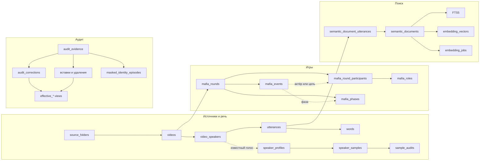
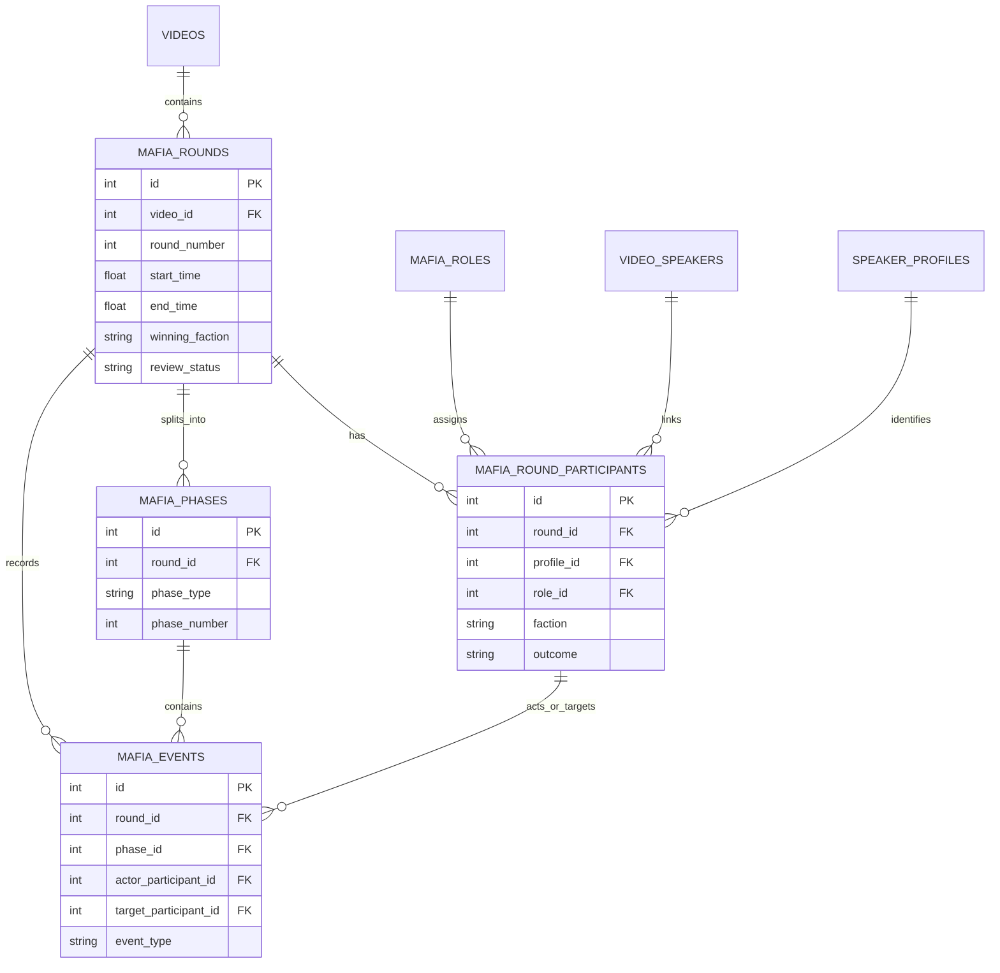
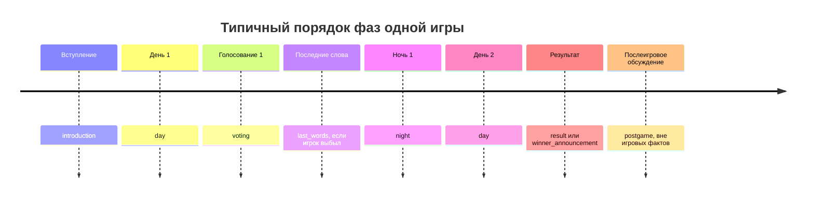
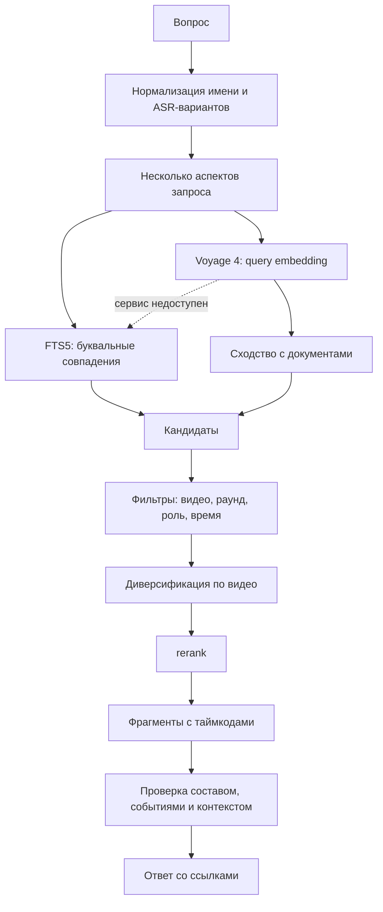
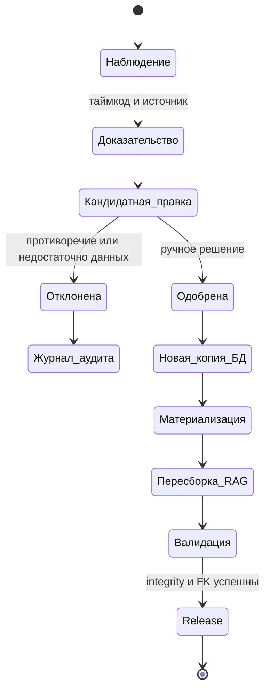
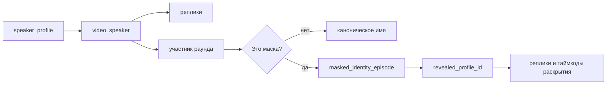

# Диаграммы RUDA Data

Эти диаграммы объясняют не код приложения, а устройство release-снимка данных:
от исходного видео до таблиц, RAG и аудиторского решения.

## Карта доменов

## Игровая ER-диаграмма

## Таймлайн раунда

`vote_out` привязан к дневному голосованию. `night_kill` — к ночи. Фаза
`last_words` объясняет, почему реплика после выбытия не является вторым
событием устранения.

## Семантический поиск

## Аудит и выпуск

## Исторические маски и голоса

Маска не переписывает профиль глобально. Одно и то же отображаемое имя может
иметь разные раскрытия в разных видео, поэтому исторические эпизоды хранятся
отдельно.
