# Диаграммы RUDA Data

Эти диаграммы объясняют не код приложения, а устройство release-снимка данных:
от исходного видео до таблиц, RAG и аудиторского решения.

Диаграммы исполнения Speechmatics — enrollment, очередь, нормализация,
восстановление и экспорт — находятся в
[`Speechmatics-пайплайн: полное руководство`](speechmatics-pipeline.md).

## От исходного файла до проверенного release

```mermaid
flowchart LR
  MEDIA[Видео и аудио] --> ASR[Транскрипция]
  ASR --> DIAR[Диаризационные дорожки]
  DIAR --> RAW[raw-снимок]
  RAW --> ENRICH[Раунды, составы, роли, фазы, события]
  ENRICH --> AUDIT[Доказательства и решения аудита]
  AUDIT --> EFFECTIVE[effective-представления]
  EFFECTIVE --> RAG[FTS5, документы, эмбеддинги]
  RAG --> VERIFY[Целостность, FK и инварианты]
  VERIFY --> RELEASE[Версионный app.db]
```

## Проверка release по манифесту

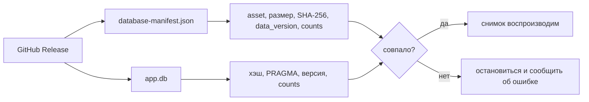

## Граница содержимого `app.db`

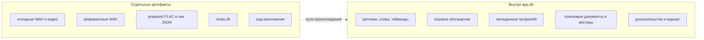

## Карта доменов

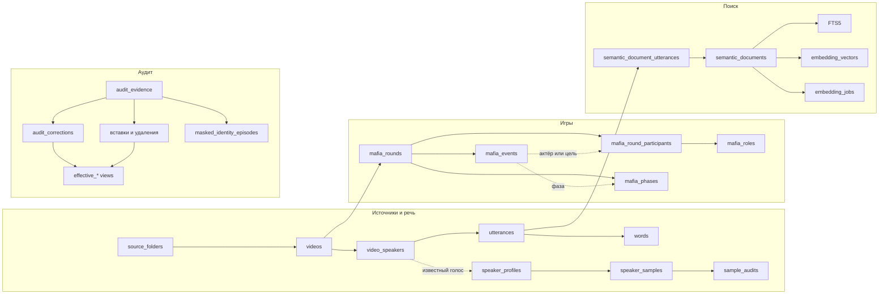

## Игровая ER-диаграмма

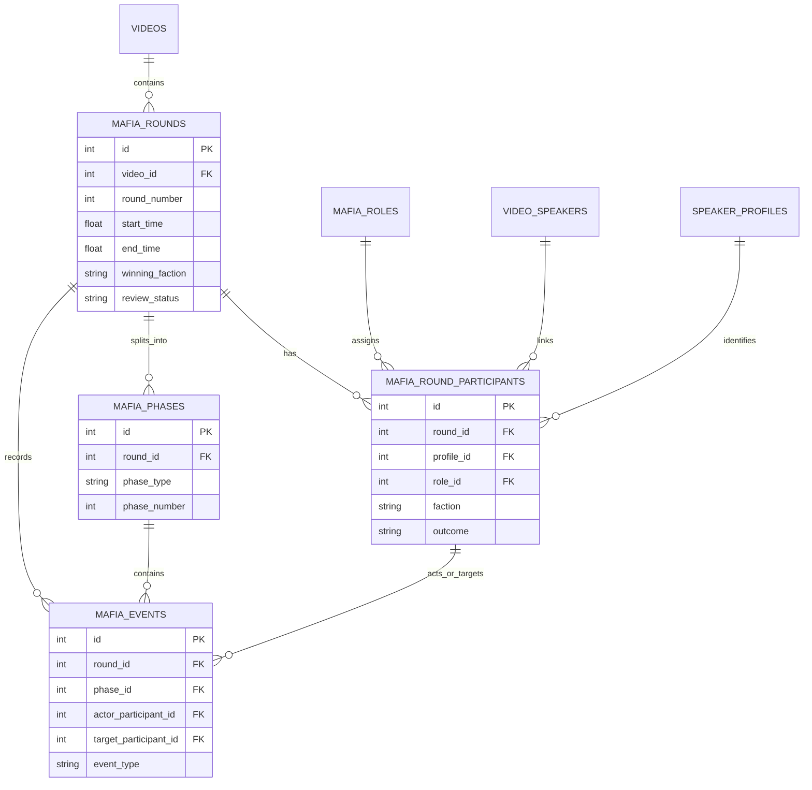

## Таймлайн раунда

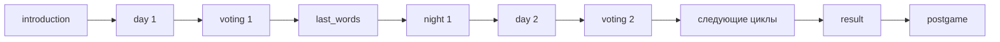

`vote_out` привязан к дневному голосованию. `night_kill` — к ночи. Фаза
`last_words` объясняет, почему реплика после выбытия не является вторым
событием устранения.

## Фаза и событие — разные уровни

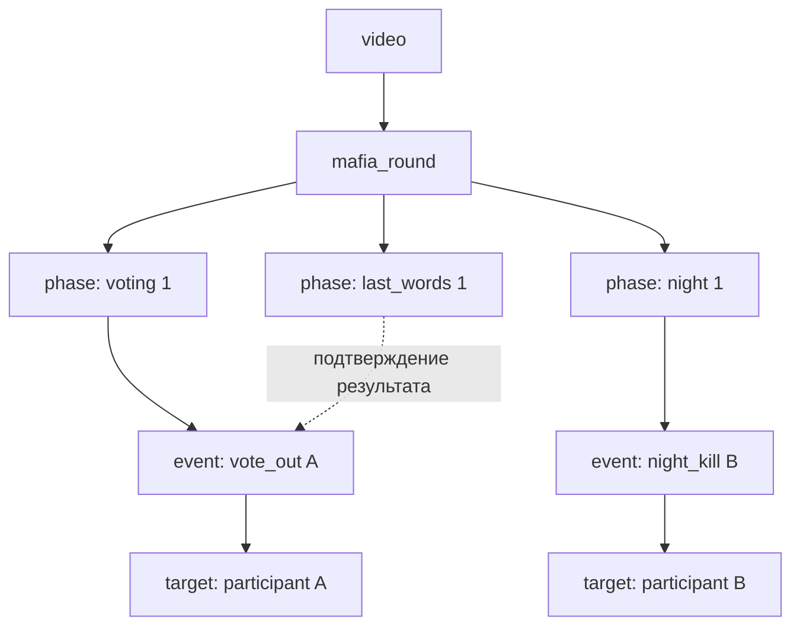

`mafia_phase` — протяжённый интервал. `mafia_event` — единичный факт.
Событие всегда принадлежит раунду, но его `phase_id` может быть `NULL`, если
точная фаза не доказана.

## Решающее дерево `event_type`

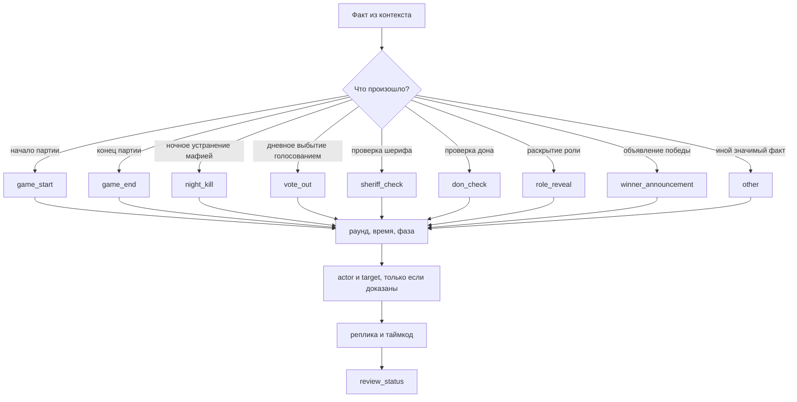

## Полнота `vote_out` в v1.6.0

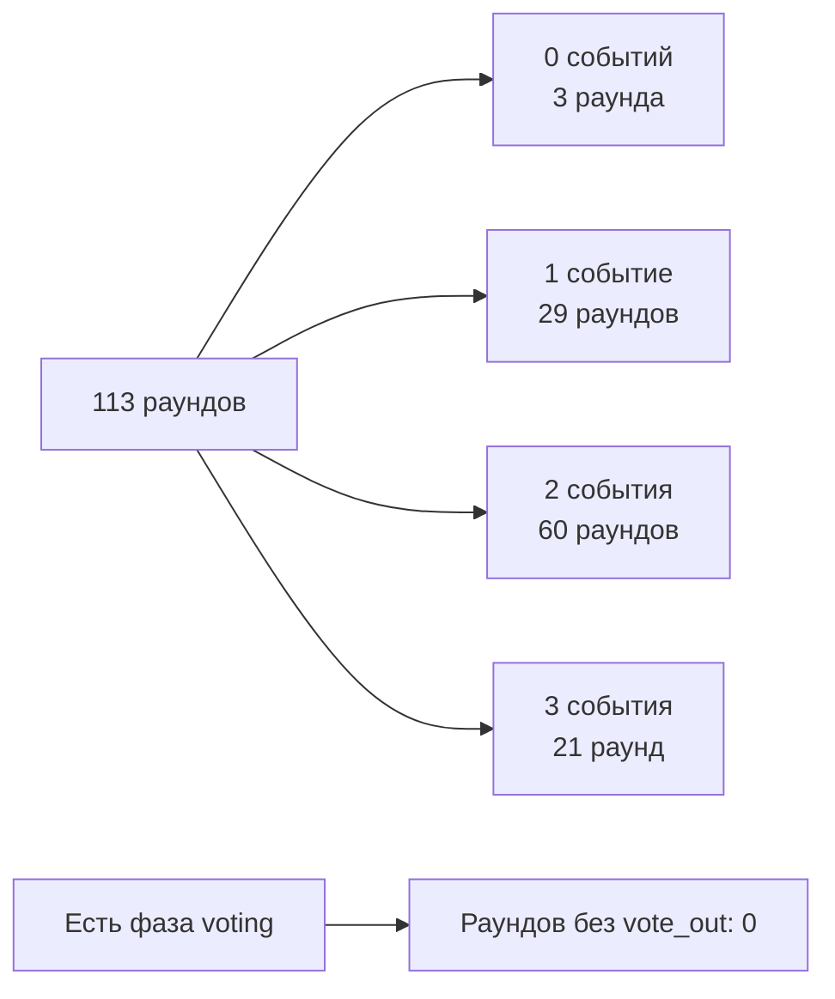

Ограничения «один `vote_out` на раунд» нет. Если видео доказывает вторую
дневную казнь, а строка отсутствует, нужна аудиторская вставка.

## ER-диаграмма речи и RAG

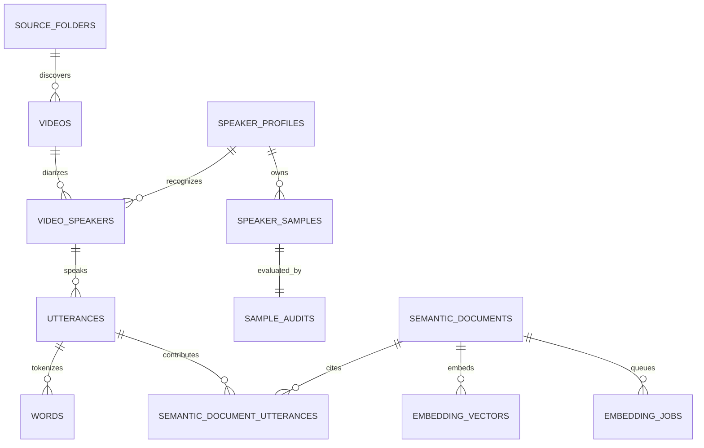

## Семантический поиск

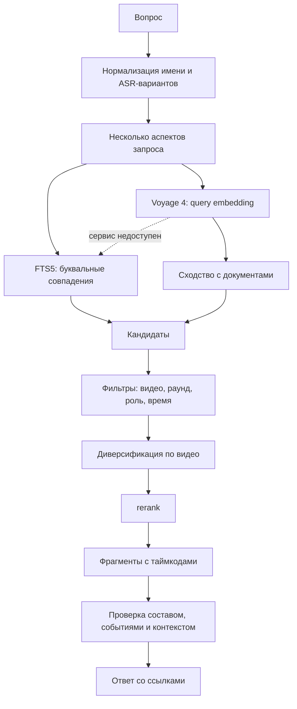

## Аудит и выпуск

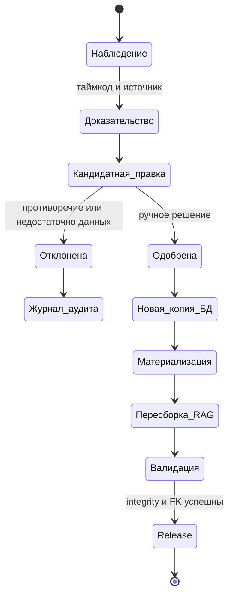

## Исторические маски и голоса

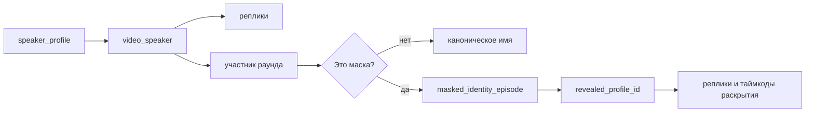

Маска не переписывает профиль глобально. Одно и то же отображаемое имя может
иметь разные раскрытия в разных видео, поэтому исторические эпизоды хранятся
отдельно.

## Защитные механизмы схемы

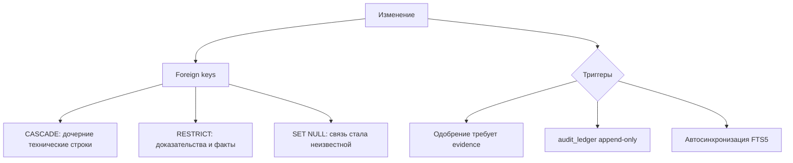
