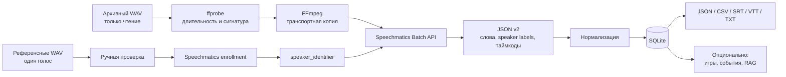
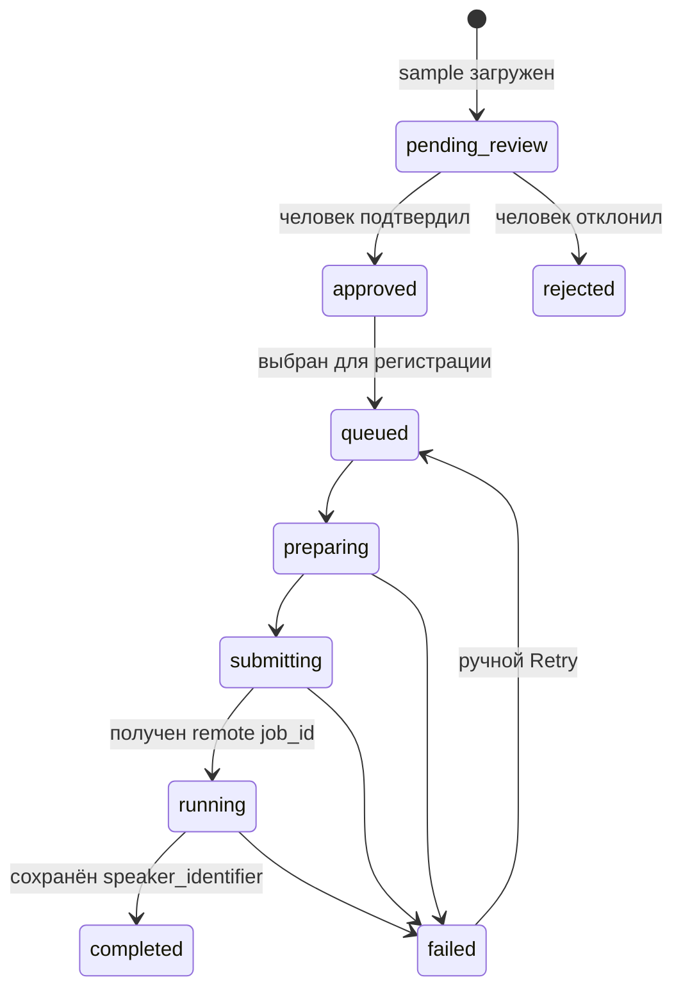
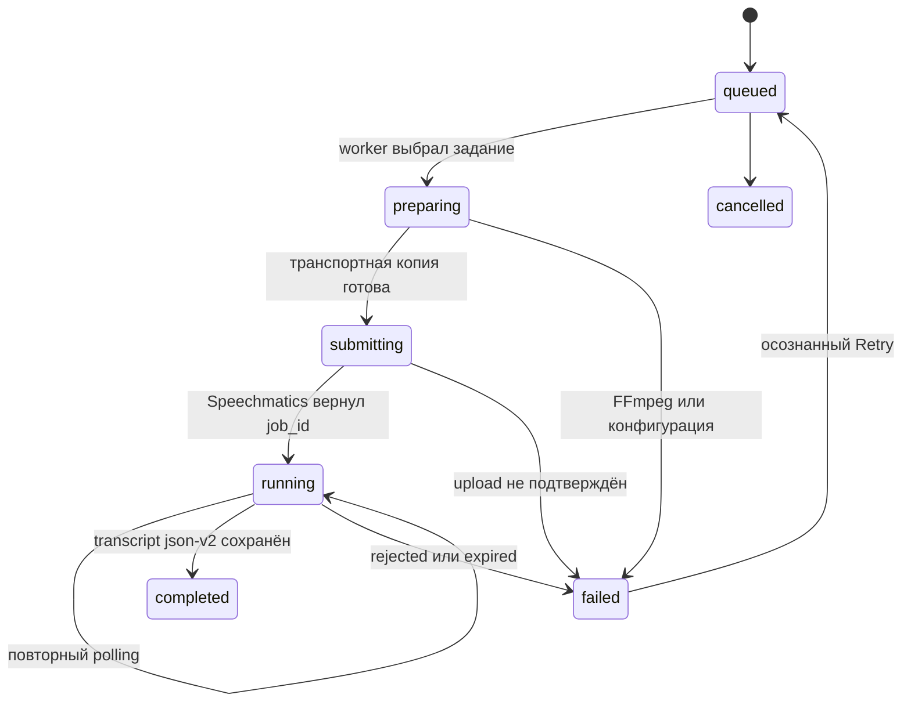
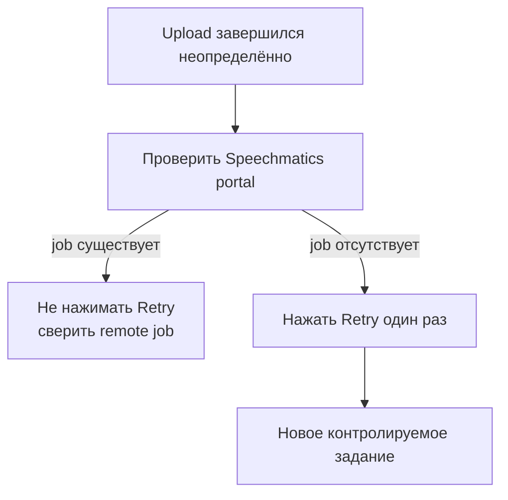
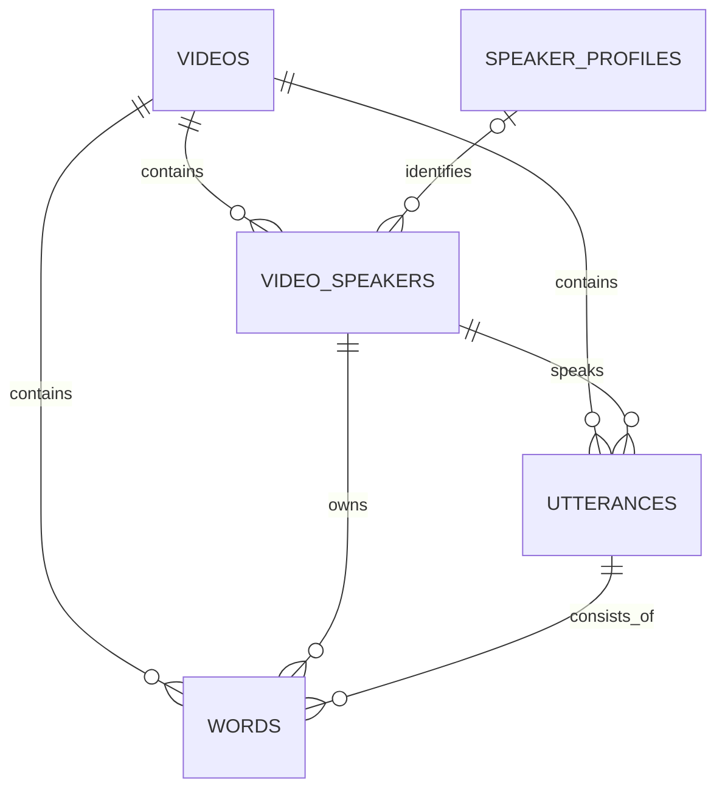
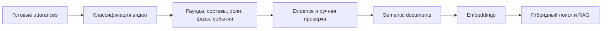
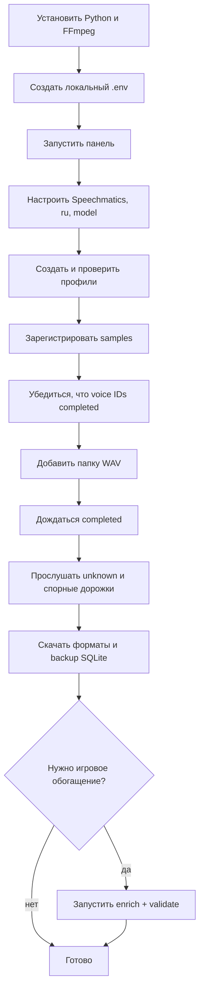

# Speechmatics-пайплайн: полное руководство

Это руководство объясняет, как из локального архива WAV получить
диаризованную расшифровку, идентифицированных известных спикеров, точные
таймкоды и нормализованную SQLite-базу. Оно рассчитано на человека, который
впервые открыл репозиторий и хочет безопасно воспроизвести весь процесс.

После чтения вы сможете:

1. запустить локальную панель;
2. зарегистрировать подтверждённые голосовые профили в Speechmatics;
3. поставить папку WAV в резюмируемую очередь;
4. понять статус каждого задания и безопасно восстановиться после ошибки;
5. получить SQLite, raw JSON, JSON, CSV, SRT, VTT и TXT;
6. при необходимости запустить отдельное игровое обогащение и поиск.

Исходный код находится в
[`pipeline/speechmatics-speaker-archive`](../pipeline/speechmatics-speaker-archive/).

## 1. Что делает пайплайн



Пайплайн одновременно решает три разные задачи:

- **распознавание речи** — что было сказано;
- **диаризация** — какой локальный спикер говорил в каждый момент;
- **speaker identification** — соответствует ли локальный спикер одному из
  зарегистрированных профилей.

Если Speechmatics не сопоставил дорожку с известным профилем, она остаётся под
локальной меткой вроде `S1`, `S2` или `UU`. Пайплайн не придумывает имя из
текста реплики. Позже дорожку можно подписать вручную в карточке видео.

## 2. Гарантии и границы

Пайплайн гарантирует:

- исходные WAV читаются, но не перезаписываются и не удаляются;
- очередь и удалённые `job_id` сохраняются в SQLite;
- обычный перезапуск не создаёт повторную отправку уже принятого задания;
- raw-ответ Speechmatics сохраняется до нормализации;
- неизвестные спикеры не получают автоматическое выдуманное имя;
- повторное сканирование неизменившегося файла не создаёт дубликат;
- API-ключи не нужны для тестов с фикстурой.

Пайплайн не гарантирует, что любая автоматическая граница реплики или имя
безошибочны. Фоновая музыка, наложение голосов, короткие фразы и смена голоса
персонажа могут ухудшить результат. Для важных выводов сохраняйте связь с
raw JSON, таймкодом и исходным аудио и проводите ручную проверку.

## 3. Из чего состоит приложение

| Компонент | Ответственность |
| --- | --- |
| Веб-панель FastAPI | настройки, профили, проверка samples, папки, видео, повтор заданий, прослушивание и экспорт |
| Последовательный worker | выбирает одно активное задание, готовит аудио, отправляет его, опрашивает Speechmatics и фиксирует результат |
| Speechmatics-клиент | создаёт Batch job, читает его состояние и загружает transcript в `json-v2` |
| Аудиослой | проверяет длительность, создаёт транспортные FLAC/MP3 и небольшие MP3-превью |
| Парсер transcript | извлекает токены, speaker labels, таймкоды и собирает реплики |
| SQLite | хранит конфигурацию, очередь, профили, видео, дорожки, реплики и слова |
| Экспорт | создаёт машиночитаемые и субтитровые форматы и согласованную копию БД |
| Необязательное обогащение | выделяет игры, раунды, участников, фазы, события и поисковые документы |

Основные разделы панели:

| Раздел | Что там делать |
| --- | --- |
| **Главная** | видеть счётчики, активное задание, ошибки worker и состояние общей паузы |
| **Настройки** | задать Speechmatics, язык, ASR-модель, sensitivity и дополнительный словарь |
| **Профили** | создать канонические профили и загрузить samples |
| **Проверка голосов** | прослушать, подтвердить и выбрать samples для enrollment |
| **Папки** | добавить источник WAV, включить рекурсивный режим и auto-scan |
| **Видео** | читать реплики, слушать фрагменты, исправлять unknown и скачивать экспорты |
| **Игры / Обогащение / Поиск** | работать с необязательным аналитическим слоем после ASR |

При первом запуске приложение автоматически создаёт отсутствующие таблицы,
применяет совместимые миграции и служебные каталоги. Это не заменяет резервную
копию перед обновлением уже существующей рабочей БД.

## 4. Требования

Для локального запуска нужны:

- Linux, macOS или другая среда с Python 3.11+;
- `ffmpeg` и `ffprobe` в `PATH`;
- доступ к Speechmatics Batch API;
- достаточно места для SQLite, raw JSON и временных транспортных копий;
- современный браузер.

Docker является альтернативой локальному Python, но не обязательным условием.
OpenRouter нужен только для необязательных этапов обогащения, эмбеддингов и RAG.

## 5. Безопасная настройка секретов

Создайте локальный файл окружения из шаблона:

```bash
cd pipeline/speechmatics-speaker-archive
cp .env.example .env
python -c "import secrets; print(secrets.token_urlsafe(48))"
```

Результат последней команды запишите в `APP_SECRET_KEY` внутри локального
`.env`. Затем укажите `SPEECHMATICS_API_KEY`. Не вставляйте реальные значения
в README, Issue, commit, screenshot или команду, которая останется в общей
истории терминала.

Ключ Speechmatics можно оставить вне `.env` и ввести через страницу
**Настройки**. Тогда он хранится в SQLite в зашифрованном виде. Защита зависит
от `APP_SECRET_KEY`, поэтому рабочую БД всё равно нельзя публиковать.

Панель не имеет встроенных пользователей и разграничения прав. По умолчанию
она слушает только `127.0.0.1`. Для удалённого доступа используйте VPN или
reverse proxy с TLS и аутентификацией.

## 6. Переменные окружения

### Обязательные для рабочего прогона

| Переменная | Назначение |
| --- | --- |
| `APP_SECRET_KEY` | ключ локального шифрования настроек; создайте уникальное длинное значение |
| `SPEECHMATICS_API_KEY` | ключ Batch API; можно вместо этого сохранить через локальную панель |
| `AUDIO_ROOT` | только Docker: абсолютный каталог WAV на хосте, монтируемый как `/audio:ro` |

### Основные параметры

| Переменная | Значение по умолчанию | Смысл |
| --- | --- | --- |
| `HOST` | `127.0.0.1` | адрес локального HTTP-сервера |
| `PORT` | `8000` | порт панели |
| `DATABASE_URL` | `sqlite:///data/app.db` | рабочая SQLite-база |
| `STORAGE_DIR` | `storage` | raw JSON, samples, transport audio, exports и clips |
| `SPEECHMATICS_BASE_URL` | европейский endpoint v2 | региональный Batch API |
| `WORKER_ENABLED` | `true` | запуск фоновой очереди вместе с приложением |
| `WORKER_POLL_SECONDS` | `10` | пауза между итерациями worker |
| `FOLDER_SCAN_INTERVAL_SECONDS` | `60` | интервал auto-scan включённых папок |
| `KEEP_PREPARED_AUDIO` | `false` | сохранять ли транспортные копии после успеха |
| `PREPARE_AUDIO` | `true` | включить подготовку аудио перед upload |
| `PREPARED_SAMPLE_RATE` | `16000` | частота транспортной копии |
| `PREPARED_CHANNELS` | `1` | число каналов транспортной копии |
| `MAX_UPLOAD_BYTES` | `980000000` | локальный предел подготовленного файла перед прямой отправкой |
| `MOCK_TRANSCRIPT_PATH` | пусто | путь к тестовому JSON вместо реального API |

### Необязательное обогащение и поиск

| Переменная | Назначение |
| --- | --- |
| `OPENROUTER_API_KEY` | единый ключ для извлечения структуры, RAG и Voyage через OpenRouter |
| `OPENROUTER_BASE_URL` | OpenAI-совместимый endpoint OpenRouter |
| `ENRICHMENT_MODEL` | основной экстрактор игр и событий |
| `ENRICHMENT_VERIFIER_MODEL` | независимая проверка извлечённых фактов |
| `ENRICHMENT_ESCALATION_MODEL` | модель для существенных конфликтов |
| `ENRICHMENT_VISION_MODEL` | проверка фактов по кадрам, если этап включён |
| `RAG_ANSWER_MODEL` | синтез ответа по найденным источникам |
| `EMBEDDING_MODEL` | модель векторизации semantic documents |
| `EMBEDDING_DIMENSIONS` | ожидаемая размерность сохраняемого вектора |
| `ENRICHMENT_PIPELINE_VERSION` | версия логики, включаемая в hash и журнал прогонов |

Эти переменные не влияют на базовую расшифровку Speechmatics. Без
`OPENROUTER_API_KEY` можно полностью выполнить enrollment, ASR, диаризацию,
идентификацию, нормализацию и экспорт.

## 7. Запуск

### Вариант A: Docker Compose

В `.env` задайте `APP_SECRET_KEY`, `SPEECHMATICS_API_KEY` и `AUDIO_ROOT`, затем:

```bash
docker compose up --build -d
docker compose ps
docker compose logs -f speaker-archive
```

Откройте `http://127.0.0.1:8000`. В разделе **Папки** указывайте `/audio`,
потому что именно под этим путём read-only каталог виден внутри контейнера.

Остановка без удаления данных:

```bash
docker compose stop
```

Каталоги `data` и `storage` смонтированы с хоста и переживают пересоздание
контейнера.

### Вариант B: локальный Python

```bash
cd pipeline/speechmatics-speaker-archive
cp .env.example .env
./run.sh
```

Скрипт проверяет наличие FFmpeg, создаёт `.venv`, устанавливает зависимости и
запускает Uvicorn на loopback-адресе.

Ручной эквивалент:

```bash
python3 -m venv .venv
source .venv/bin/activate
python -m pip install -r requirements.txt
uvicorn app.main:app --host 127.0.0.1 --port 8000
```

## 8. Проверка перед использованием API

Сначала убедитесь, что локальная часть работает без платной отправки:

```bash
source .venv/bin/activate
python scripts/check_public_tree.py
python -m pytest -q
curl -fsS http://127.0.0.1:8000/health
```

Ожидается HTTP 200 и JSON с `ok: true`. Тесты используют локальные фикстуры и
не расходуют квоту Speechmatics.

## 9. Подготовка голосовых профилей

### Требования к sample

Интерфейс принимает WAV длительностью от 5 до 30 секунд. Практически лучше
использовать несколько чистых samples по 10–30 секунд, чем один длинный файл.
В каждом sample должен говорить только целевой спикер.

Не подходят:

- наложение другого голоса;
- громкая музыка;
- длинная тишина;
- сильно обрезанные слова;
- один и тот же звуковой дубль под разными именами.

### Ручной порядок

1. Откройте **Профили** и создайте каноническое имя.
2. Загрузите WAV в профиль.
3. Откройте **Проверка голосов**.
4. Прослушайте каждый sample и подтвердите либо отклоните его.
5. Отдельно отметьте подтверждённый sample как используемый для регистрации.
6. Подтвердите сам профиль.
7. Только после проверки всех профилей нажмите запуск регистрации.

До этого момента платные enrollment jobs не создаются.

### Автоматический аудит существующих референсов

Если уже есть папки вида `reference_uploads/<имя>/*.wav`, можно сформировать
кандидатов аудита:

```bash
<ecapa-python> scripts/audit_reference_profiles.py \
  --source <reference_uploads> \
  --output-json data/profile_audit.json \
  --output-csv data/profile_audit.csv

.venv/bin/python scripts/import_reference_profiles.py \
  --audit-json data/profile_audit.json
```

Аудит проверяет технические параметры, тишину, перегруз, точные дубли и
сходство голосов. Его результат остаётся кандидатом: выбор для enrollment всё
равно требует ручного подтверждения в панели. Импорт идемпотентен и не меняет
исходные reference WAV.

## 10. Как проходит enrollment



Для enrollment sample создаётся FLAC 16 кГц mono. В запрос передаются
`diarization=speaker`, `get_speakers=true` и `prefer_current_speaker=true`.
Speechmatics возвращает `speaker_identifier`, который сохраняется вместе с
языком и моделью регистрации.

Если сервис обнаружил несколько голосов и доминирующий занимает менее 80% их
суммарной речи, sample отклоняется как смешанный. Для профиля нужен более
чистый фрагмент.

Запуск регистрации требует решения по всем профилям. У каждого одобренного
профиля должен быть хотя бы один подтверждённый и выбранный sample. За один
запуск интерфейс не принимает более 50 выбранных samples.

Важно: `speaker_identifier` связан с языком и ASR-моделью. После смены
`standard` на `enhanced` или смены языка зарегистрируйте samples заново.

## 11. Добавление архива WAV

В разделе **Папки** добавьте каталог, содержащий `.wav`:

- включите рекурсивный режим, если WAV лежат во вложенных каталогах;
- включите auto-scan для автоматического обнаружения новых файлов;
- при Docker указывайте `/audio`;
- при локальном запуске указывайте абсолютный путь, доступный процессу.

Для файла вычисляется сигнатура из абсолютного пути, размера и времени
изменения. Неизменившийся файл повторно не добавляется. Если содержимое по тому
же пути заменено и метаданные изменились, создаётся новая версия записи.

Сканер принимает только `.wav`. Он читает длительность через `ffprobe` и для
каждого нового файла создаёт `video` и задание типа `video` со статусом
`queued`.

## 12. Подготовка аудио к отправке

Транспортная копия нужна для уменьшения upload и не является новым мастер-файлом.

| Вход | Транспортный формат | Параметры |
| --- | --- | --- |
| Enrollment sample | FLAC | mono, 16 кГц, compression level 8 |
| Видео короче 2 часов | FLAC | mono, 16 кГц, compression level 8 |
| Видео от 2 часов | MP3 | mono, 16 кГц, 128 кбит/с |
| Фрагмент для браузерного прослушивания | MP3 | mono, 24 кГц, 128 кбит/с, максимум 10 минут |

MP3-превью и транспортный MP3 не подменяют исходный WAV. После успешной
обработки транспортная копия удаляется, если `KEEP_PREPARED_AUDIO=false`, и
только если она действительно находится внутри служебного каталога prepared.

Если подготовленный файл всё равно достиг локального лимита upload, задание
останавливается с ошибкой вместо отправки обрезанного аудио.

## 13. Как формируется запрос диаризации

Для видео всегда передаётся `diarization=speaker`. Дополнительно формируется
список известных профилей.

Voice ID попадает в запрос, только если одновременно выполнены условия:

- профиль активен и подтверждён вручную;
- sample подтверждён и выбран для enrollment;
- enrollment завершён и вернул `speaker_identifier`;
- язык и модель identifier совпадают с языком и моделью видео.

Speechmatics принимает не более 50 voice ID. При построении video job система
распределяет лимит по кругу: сначала по одному identifier каждого профиля,
затем по второму и так далее. Поэтому профили в конце списка не вытесняются
несколькими samples первых профилей.

Параметр `speaker_sensitivity`, если он задан, передаётся в diarization config.
Дополнительный словарь принимает до 1000 непустых записей, каждая не длиннее
шести слов. Он помогает распознавать имена и термины, но не назначает спикера.

## 14. Жизненный цикл video job



Worker обрабатывает только одно активное задание. Enrollment имеет приоритет
перед видео, чтобы следующие video jobs получили свежие идентификаторы.

Если API-ключ ещё не настроен, задание остаётся в `queued` и получает следующую
попытку примерно через 30 секунд. Ошибка обычного polling не создаёт новый job:
состояние остаётся `running`, и worker повторит безопасный GET позже.

При ответах 401, 402 или 403 обработка всего архива ставится на паузу, потому
что это обычно проблема аккаунта, оплаты или ключа. После исправления причины
на dashboard нажмите **Возобновить после исправления причины**. Состояние паузы
хранится в БД, поэтому один перезапуск приложения сам по себе её не снимает.

## 15. Защита от двойной оплаты

Критическая граница — отправка файла. После успешного ответа Speechmatics
`remote_job_id` сохраняется в SQLite, и последующие перезапуски только опрашивают
этот job.

Если процесс оборвался во время upload и не успел получить `job_id`, приложение
не отправляет файл автоматически повторно. Оно помечает задание ошибкой и просит
сначала проверить портал Speechmatics. Только убедившись, что удалённого job нет,
нажимайте **Повторить**.



## 16. Нормализация transcript JSON v2

Парсер читает элементы `word`, `entity` и `punctuation`, выбирает лучшую
альтернативу и сохраняет исходный JSON каждого токена.

Реплика завершается, когда:

- меняется speaker label; или
- пауза между соседними токенами превышает 2 секунды.

Для реплики сохраняются начало, конец, текст, число слов и средняя уверенность
слов. Для каждого слова сохраняются собственные границы, confidence, язык,
тип токена, правила прикрепления пунктуации и raw JSON.



Повторная нормализация одного видео заменяет его прежние `video_speakers`,
`utterances` и `words` согласованно, а не добавляет второй набор поверх первого.

## 17. Что появляется после успешной обработки

| Результат | Где хранится | Для чего нужен |
| --- | --- | --- |
| Raw Speechmatics JSON v2 | каталог transcripts | повторный парсинг и аудит без нового API-запроса |
| Текстовая стенограмма | `videos.transcript_text` | быстрый просмотр |
| Локальные дорожки | `video_speakers` | связь label с профилем и статистика речи |
| Реплики | `utterances` | кто, что и в каком временном интервале сказал |
| Слова | `words` | точные word-level таймкоды и confidence |
| Очередь и remote IDs | `transcription_jobs` | возобновление и аудит отправок |
| Рабочая база | `data/app.db` | единый нормализованный архив |

Полное описание таблиц и полей находится в
[документации схемы](database-schema.md).

## 18. Просмотр и ручное исправление

На странице **Видео** можно:

- фильтровать и открывать обработанные записи;
- видеть локальные speaker labels и длительность их речи;
- читать реплики с таймкодами;
- воспроизводить небольшой фрагмент исходного WAV через кэшируемое MP3-превью;
- связать неизвестную дорожку с подтверждённым профилем;
- оставить дорожку неизвестной и задать только отображаемую метку;
- повторить действительно неуспешное задание;
- скачать нужный формат.

Ручная привязка изменяет только метаданные `video_speakers`; исходное аудио и
raw transcript остаются неизменными.

## 19. Экспорт

Для каждого видео доступны:

| Формат | Содержание |
| --- | --- |
| `raw` | неизменённый Speechmatics JSON v2 |
| `json` | метаданные видео и массив реплик с именами и confidence |
| `csv` | одна реплика на строку, секунды и форматированные таймкоды |
| `srt` | субтитры с именем спикера |
| `vtt` | WebVTT с именем спикера |
| `txt` | читаемая стенограмма с таймкодами |

Кнопка **Скачать БД** создаёт согласованную копию SQLite через Backup API. Не
копируйте активный `app.db` обычной файловой командой во время записи worker.

Пакетный экспорт всех завершённых видео:

```bash
.venv/bin/python scripts/export_all.py
```

## 20. Наблюдение за прогрессом

Dashboard показывает текущее активное задание, наличие API-ключа, состояние
worker и причину общей паузы. Более подробная история хранится в
`transcription_jobs`.

Полезный read-only запрос:

```sql
SELECT kind, status, COUNT(*) AS jobs
FROM transcription_jobs
GROUP BY kind, status
ORDER BY kind, status;
```

Для видео:

```sql
SELECT id, title, status, remote_job_id, error_message
FROM videos
ORDER BY id;
```

Не выполняйте мутирующие SQL-запросы в активной рабочей БД без резервной копии.

## 21. Диагностика ошибок

| Симптом | Вероятная причина | Безопасное действие |
| --- | --- | --- |
| Задания остаются `queued` | не настроен Speechmatics key или processing paused | проверить **Настройки** и нажать возобновление на dashboard только после исправления причины |
| `ffmpeg не найден` | бинарник отсутствует в `PATH` | установить FFmpeg и повторить локальную подготовку |
| `prepared audio is still larger` | транспортный файл превысил прямой upload limit | разделить источник или использовать поддерживаемый внешний fetch workflow |
| Enrollment вернул несколько спикеров | sample содержит чужой голос | заменить sample чистым фрагментом |
| В video config нет известных speakers | профиль/sample не подтверждён либо model/language не совпали | проверить review, enrollment model и language |
| 401/402/403 | ключ, доступ или баланс аккаунта | исправить аккаунт, затем снять общую паузу |
| 429 | временное ограничение частоты | подождать; не считать ключ истёкшим только по одному 429 |
| Upload outcome unknown | соединение оборвалось до получения job ID | сначала проверить портал, затем решать о Retry |
| Polling временно упал | сетевой сбой после получения job ID | ничего не переотправлять; worker повторит GET |
| Дорожка осталась `S1` | Speechmatics не сопоставил её с профилем | прослушать разные участки и связать вручную либо оставить unknown |
| Реплика слишком длинная | один speaker label и паузы не превышали 2 секунды | ориентироваться на word timestamps или улучшить постобработку границ отдельно |

## 22. Резервное копирование и перенос

Сохраняйте вместе:

- согласованную резервную копию SQLite;
- каталог raw transcripts;
- подтверждённые reference samples, если у вас есть право их хранить;
- локальный `.env` отдельно от Git и резервных копий для публикации.

Каталог исходных WAV не является частью репозитория. Поля `source_path` в БД
могут потребовать перенастройки после переноса на другой компьютер.

Не публикуйте рабочую БД без аудита: в ней могут быть локальные пути и
зашифрованные настройки.

## 23. Опциональное игровое обогащение

Этот этап запускается только после готовых Speechmatics-транскриптов и не
влияет на исходную диаризацию:

```bash
.venv/bin/python scripts/enrich_archive.py probe
.venv/bin/python scripts/enrich_archive.py extract
.venv/bin/python scripts/enrich_archive.py frames
.venv/bin/python scripts/enrich_archive.py documents --force
.venv/bin/python scripts/enrich_archive.py embeddings
.venv/bin/python scripts/enrich_archive.py status
.venv/bin/python scripts/validate_enrichment.py
```



Для этого этапа нужен `OPENROUTER_API_KEY`. Автоматическая уверенность модели
не заменяет доказательство: игровые факты должны ссылаться на реплику, кадр или
ручное решение. Подробная архитектура обогащённых таблиц описана в основном
[README данных](../README.md).

## 24. Тестовый прогон без Speechmatics

Для разработки можно направить `MOCK_TRANSCRIPT_PATH` на fixture JSON. Worker
пройдёт подготовку и нормализацию, но не отправит аудио во внешний API.

Автоматические тесты проверяют:

- WAV → подготовленное аудио;
- идемпотентный scanner;
- enrollment одного голоса и отказ смешанному sample;
- фильтрацию voice ID по model/language;
- лимиты и словарь в diarization config;
- нормализацию дорожек, реплик и слов;
- экспорты;
- основные review-взаимодействия;
- сохранение и безопасное снятие общей паузы worker;
- инварианты игрового обогащения.

Команды:

```bash
python -m pip install -r requirements-dev.txt
python scripts/check_public_tree.py
python -m pytest -q
python -m compileall -q app scripts
```

## 25. Минимальный runbook от нуля до готовой БД



Контрольный список:

- [ ] `APP_SECRET_KEY` уникален и не находится в Git;
- [ ] панель доступна только локально или через защищённый туннель;
- [ ] профиль и каждый выбранный sample подтверждены человеком;
- [ ] язык и модель enrollment совпадают с video jobs;
- [ ] исходный WAV подключён только для чтения;
- [ ] все видео достигли `completed` либо имеют объяснённую ошибку;
- [ ] unknown-дорожки просмотрены, но не подписаны наугад;
- [ ] экспорт и SQLite backup созданы после завершения worker;
- [ ] перед публикацией удалены секреты, медиа, локальные пути и runtime-файлы.

## 26. Связанные документы

- [README набора данных](../README.md)
- [Полная схема SQLite](database-schema.md)
- [Диаграммы набора данных](diagrams.md)
- [Проверка сборки пайплайна](../pipeline/speechmatics-speaker-archive/docs/validation.md)
- [Безопасная эксплуатация](../pipeline/speechmatics-speaker-archive/SECURITY.md)
- [README исходного кода](../pipeline/speechmatics-speaker-archive/README.md)
