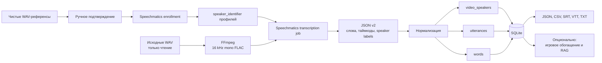

# Speechmatics Speaker Archive

Локальное веб-приложение для последовательной обработки больших WAV-файлов через Speechmatics Speaker Identification.

> **Публичный воспроизводимый снимок.** В этой папке находится полный исходный
> код рабочего контура на момент публикации: веб-панель, очередь, подготовка
> аудио, регистрация голосовых профилей, Speechmatics API, диаризация,
> нормализация результата в SQLite, экспорт, тесты и опциональное обогащение.
> Реальные ключи, `.env`, исходные WAV, референсные WAV, рабочая БД, raw-ответы,
> логи и созданные клипы намеренно не включены.

Полное руководство по установке, конфигурации, enrollment, очереди,
диаризации, восстановлению и экспорту находится в
[`docs/speechmatics-pipeline.md`](../../docs/speechmatics-pipeline.md).

Оно решает полный поток:

1. Создаёт именованные профили людей.
2. Загружает 5–30-секундные WAV-образцы голоса и получает `speaker_identifier`.
3. Сканирует указанную локальную папку с многчасовыми WAV.
4. Обрабатывает строго по одному заданию, чтобы не отправлять весь архив одновременно.
5. Автоматически преобразует исходный WAV во временный FLAC 16 кГц mono, не меняя оригинал.
6. Отправляет известные voice ID, выполняет распознавание, диаризацию и идентификацию.
7. Сохраняет исходный JSON и нормализует данные в SQLite: видео → спикеры → реплики → слова.
8. Даёт поиск, ручное переименование неизвестных спикеров и экспорт RAW/JSON/CSV/SRT/VTT/TXT/SQLite.
9. Обогащает архив структурой игр в мафию и поддерживает гибридный поиск по тексту и смыслу.

## Архитектура потока



Финальное имя назначается результату идентификации внутри diarization job:
Speechmatics сравнивает локальные speaker labels с переданными зарегистрированными
`speaker_identifier`. Неизвестные дорожки сохраняются как локальные `S1`, `S2` и
не получают выдуманного имени. Исходный WAV не перезаписывается.

## Быстрый запуск через Docker

```bash
cp .env.example .env
python -c "import secrets; print(secrets.token_urlsafe(48))"
# Вставьте результат в APP_SECRET_KEY внутри .env
# Укажите AUDIO_ROOT=/абсолютный/путь/к/папке/с/wav

docker compose up --build -d
```

Откройте `http://localhost:8000`. Compose публикует порт только на
`127.0.0.1`; не меняйте это без VPN или reverse proxy с авторизацией.

В Docker папка хоста из `AUDIO_ROOT` доступна приложению как `/audio`. Поэтому в разделе **Папки** добавляйте путь `/audio`, а не исходный путь хоста.

API-ключ можно указать в `.env` как `SPEECHMATICS_API_KEY` либо сохранить через страницу **Настройки**. Во втором случае он шифруется перед записью в SQLite.

## Локальный запуск без Docker

Требуются Python 3.11+ и FFmpeg.

```bash
cp .env.example .env
./run.sh
```

Либо вручную:

```bash
python3 -m venv .venv
source .venv/bin/activate
pip install -r requirements.txt
uvicorn app.main:app --host 127.0.0.1 --port 8000
```

## Правильный порядок работы

### 1. Настройки

Откройте **Настройки**:

- API key;
- язык `ru`;
- модель `enhanced` (или `standard` ради скорости);
- словарь имён, аббревиатур и терминов — по одному на строку.

Не меняйте модель после регистрации профилей без повторной регистрации образцов: идентификаторы голоса привязаны к модели. `melia-1` намеренно не предлагается, потому что Speaker Identification для неё не поддерживается.

### 2. Профили

Создайте профиль и загрузите 1–3 чистых WAV-образца длиной 5–30 секунд. В каждом образце должен говорить только один человек. Полезно дать разные условия: телефон, обычная комната, хороший микрофон.

Новые и импортированные образцы сначала получают статус `pending_review`. На странице
**Проверка голосов** каждый клип можно прослушать, подтвердить или отклонить и отдельно
выбрать для регистрации. До нажатия защищённой кнопки регистрации задания в Speechmatics
не создаются.

Speechmatics принимает до 50 идентификаторов в одно задание. Программа распределяет их
по профилям по кругу: сначала один идентификатор каждого подтверждённого персонажа, затем
второй и так далее. Это не позволяет ранним профилям вытеснить последние из лимита.

### Импорт существующего набора референсов

Автоматический аудит исходные WAV не меняет. Он проверяет длительность, читаемость,
громкость, тишину, перегруз, точные звуковые дубли, однородность голоса внутри папки и
сходство с чужими профилями:

```bash
/path/to/ecapa-python scripts/audit_reference_profiles.py \
  --source /path/to/speaker_project/reference_uploads \
  --output-json data/profile_audit.json \
  --output-csv data/profile_audit.csv

.venv/bin/python scripts/import_reference_profiles.py \
  --audit-json data/profile_audit.json
```

Импорт идемпотентен: повторный запуск не создаёт дубликаты, не стирает ручные решения и
не создаёт API-задания. Все клипы копируются в `storage/samples/imported/`; исходная папка
остаётся неизменной.

### 3. Папка WAV

Добавьте абсолютный путь. Приложение сразу просканирует его и затем, при включённом auto-scan, будет находить новые `.wav`.

Файл определяется по пути, размеру и времени изменения. Если содержимое по тому же пути изменилось, оно будет зарегистрировано как новая версия.

### 4. Обработка и БД

Worker держит только одно активное задание. `remote_job_id` сохраняется до завершения, поэтому обычный перезапуск не создаёт повторную отправку уже принятого задания.

Для каждого завершённого видео доступны:

- все найденные спикеры и длительность их речи;
- именованные профили или метки `S1`, `S2` для неизвестных;
- реплики с началом, концом, текстом и средней уверенностью;
- отдельные слова/пунктуация с таймкодами и исходным JSON;
- RAW JSON, JSON реплик, CSV и SRT.

### 5. Игры в мафию и смысловой поиск

После завершения распознавания можно запустить отдельный резюмируемый этап
обогащения. Он не меняет исходные WAV и не перезапускает Speechmatics:

```bash
.venv/bin/python scripts/enrich_archive.py probe
.venv/bin/python scripts/enrich_archive.py extract
.venv/bin/python scripts/enrich_archive.py frames
.venv/bin/python scripts/enrich_archive.py documents --force
.venv/bin/python scripts/enrich_archive.py embeddings
.venv/bin/python scripts/enrich_archive.py status
.venv/bin/python scripts/validate_enrichment.py
```

`extract` классифицирует запись, выделяет раунды, участников, фазы, события,
победившую сторону и доказательства из реплик. Основной массив обрабатывается
бесплатной `inclusionai/ling-3.0-flash:free`, независимую проверку делает
`nvidia/nemotron-3-super-120b-a12b:free`. `openai/gpt-5.6-luna` вызывается только
при существенном конфликте результатов. Числовая уверенность модели не считается
доказательством сама по себе: роли принимаются только из контролируемого словаря
и при наличии ссылки на реплику или кадр.

`frames` проверяет недостающие фактические роли по кадрам исходного YouTube-видео.
Игровые заявления вроде «я шериф» не считаются фактической ролью. Исходное видео
и аудио не модифицируются; локально сохраняются только контрольные JPEG-кадры.

`documents` создаёт небольшие смысловые документы, не пересекающие границы
раундов. `embeddings` записывает 1024-мерные векторы `voyageai/voyage-4` в
отдельную таблицу. Связи с видео, раундом, репликами, спикерами и таймкодами
остаются в нормализованных таблицах, поэтому фильтры работают до векторного
ранжирования.

В интерфейсе появляются:

- **Игры** — список игр и карточки раундов с участниками, ролями, ночами и аудио;
- **Поиск** — FTS5 + смысловой поиск с фильтрами и ответом по найденным источникам;
- **Обогащение** — прогресс и очередь ручной проверки спорных данных.

Повторный запуск без `--force` пропускает уже обработанные версии расшифровок.
После изменения разметки раундов заново выполните `documents --force`, затем
`embeddings`. Пока полный прогон ещё идёт, проверку можно выполнить с
`--allow-incomplete`; итоговая проверка без этого флага требует все видео и все
эмбеддинги.

Кнопка **Скачать БД** создаёт согласованную резервную копию SQLite через SQLite Backup API.

Полная схема: [`docs/database-schema.md`](docs/database-schema.md).

## Работа с файлами 2–3 часа

Исходные WAV могут быть очень большими. Перед загрузкой приложение создаёт временный FLAC 16 кГц mono в `storage/prepared`. Исходный файл не изменяется. После успешной обработки FLAC удаляется, если `KEEP_PREPARED_AUDIO=false`.

Если даже подготовленный файл превышает настроенный предел прямой загрузки, задача завершается ошибкой вместо отправки неполного файла.

## Ограничение voice ID

В одно задание передаются максимум 50 активных идентификаторов. Приложение берёт их в порядке создания профилей и образцов. Неизвестные участники всё равно сохраняются как `S1`, `S2` и могут быть подписаны вручную после обработки.

## Надёжность и ошибки

- Состояния очереди хранятся в БД.
- Ошибка опроса удалённого задания не создаёт повторную отправку.
- Если приложение упало именно во время upload до получения `job_id`, задание помечается ошибкой: сначала проверьте портал Speechmatics, затем нажимайте **Повторить**. Это защищает от двойной оплаты.
- Исходные WAV никогда не удаляются.
- Полученный RAW JSON сохраняется локально сразу после завершения.

## Тесты

```bash
pip install -r requirements-dev.txt
pytest -q
```

Есть тесты подготовки FLAC, сканирования папки, построения реплик, проверки enrollment-сэмпла и записи нормализованных таблиц.

## Безопасность

Это локальная административная панель без учётных записей. Не публикуйте порт 8000 напрямую в интернет. Для удалённого доступа поставьте приложение за VPN или reverse proxy с авторизацией.

Полный чек-лист находится в [`SECURITY.md`](SECURITY.md). Перед commit/push
запускайте `python scripts/check_public_tree.py`.

Обрабатывайте и идентифицируйте голоса только при наличии законного основания и необходимых согласий участников.
